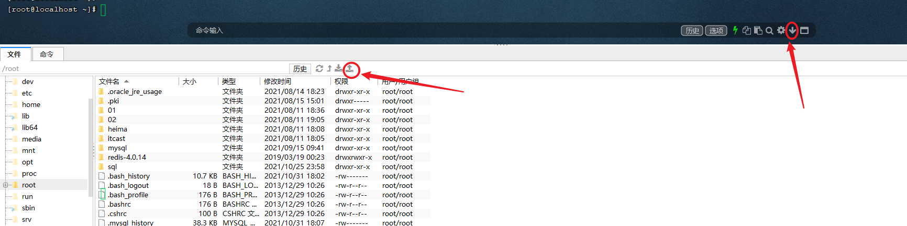

# 一、LINUX安装MySQL

### 1. 准备一台Linux服务器

- 云服务器或者虚拟机都可以

- Linux的版本为CentOS7

### 2. 下载Linux版MySQL安装包

https://downloads.mysql.com/archives/community/


### 3. 上传MySQL安装包 



### 4. 创建目录,并解压

```shell
mkdir mysql

tar -xvf mysql-8.0.26-1.el7.x86_64.rpm-bundle.tar -C mysql
```

### 5. 安装mysql的安装包

```shell
cd mysql

yum -y remove mysql-libs
yum -y install openssl-devel
yum -y install net-tools

rpm -ivh mysql-community-common-8.0.26-1.el7.x86_64.rpm 

rpm -ivh mysql-community-client-plugins-8.0.26-1.el7.x86_64.rpm 

rpm -ivh mysql-community-libs-8.0.26-1.el7.x86_64.rpm 

rpm -ivh mysql-community-libs-compat-8.0.26-1.el7.x86_64.rpm

rpm -ivh  mysql-community-devel-8.0.26-1.el7.x86_64.rpm

rpm -ivh mysql-community-client-8.0.26-1.el7.x86_64.rpm

rpm -ivh  mysql-community-server-8.0.26-1.el7.x86_64.rpm
```

### 6. 启动MySQL服务

```shell
systemctl start mysqld
```

### 7. 查询自动生成的root用户密码

```shell
grep 'temporary password' /var/log/mysqld.log
```

### 8. 修改root用户密码

##### 8.1 设置密码复杂度校验规则

```mysql
set global validate_password.policy = 0;
set global validate_password.length = 6;
```

##### 8.2 修改密码

```mysql
ALTER USER 'root'@'localhost' IDENTIFIED BY '123456';
```

### 9. 通过可视化工具远程连接连接虚拟机MySQL

##### 9.1 创建root用户

```mysql
create user 'admin'@'%' IDENTIFIED WITH mysql_native_password BY '123456';
```

- 默认的root用户只能当前节点localhost访问，无法远程访问，故需要创建一个root账户用于户远程访问

##### 9.2 分配root用户权限

```mysql
grant all on *.* to 'admin'@'%';
```

##### 9.3 关闭防火墙

```shell
systemctl disable firewalld
```

- stop指令下次还会开启