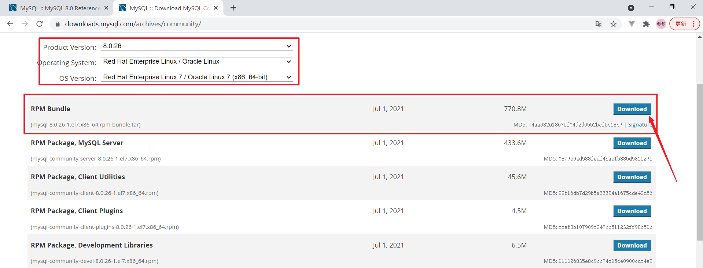
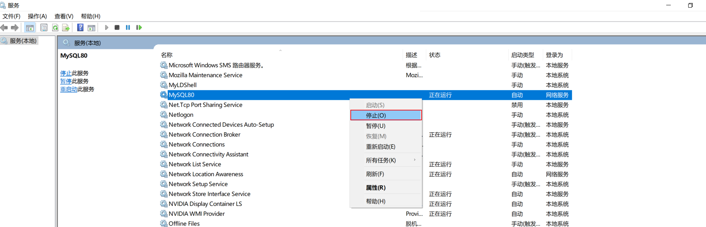

# 一、LINUX安装MySQL

### 1. 准备一台Linux服务器

- 云服务器或者虚拟机都可以

- Linux的版本为CentOS7

### 2. 下载Linux版MySQL安装包

https://downloads.mysql.com/archives/community/



### 3. 上传MySQL安装包 


### 4. 创建目录,并解压

```shell
mkdir mysql

tar -xvf mysql-8.0.26-1.el7.x86_64.rpm-bundle.tar -C mysql
```

### 5. 安装mysql的安装包

```shell
cd mysql

yum -y remove mysql-libs
yum -y install openssl-devel
yum -y install net-tools

rpm -ivh mysql-community-common-8.0.26-1.el7.x86_64.rpm 

rpm -ivh mysql-community-client-plugins-8.0.26-1.el7.x86_64.rpm 

rpm -ivh mysql-community-libs-8.0.26-1.el7.x86_64.rpm 

rpm -ivh mysql-community-libs-compat-8.0.26-1.el7.x86_64.rpm

rpm -ivh  mysql-community-devel-8.0.26-1.el7.x86_64.rpm

rpm -ivh mysql-community-client-8.0.26-1.el7.x86_64.rpm

rpm -ivh  mysql-community-server-8.0.26-1.el7.x86_64.rpm
```

### 6. 启动MySQL服务

```shell
systemctl start mysqld
```

### 7. 查询自动生成的root用户密码

```shell
grep 'temporary password' /var/log/mysqld.log
```

### 8. 修改root用户密码

##### 8.1 设置密码复杂度校验规则

```mysql
set global validate_password.policy = 0;
set global validate_password.length = 6;
```

##### 8.2 修改密码

```mysql
ALTER USER 'root'@'localhost' IDENTIFIED BY '123456';
```

### 9. 通过可视化工具远程连接连接虚拟机MySQL

##### 9.1 创建root用户

```mysql
create user 'admin'@'%' IDENTIFIED WITH mysql_native_password BY '123456';
```

- 默认的root用户只能当前节点localhost访问，无法远程访问，故需要创建一个root账户用于户远程访问

##### 9.2 分配root用户权限

```mysql
grant all on *.* to 'admin'@'%';
```

##### 9.3 关闭防火墙

```shell
systemctl disable firewalld
```

- stop指令下次还会开启

# 二、LINUX卸载MySQL

### 1.停止MySQL服务

```shell
systemctl stop mysqld
```

### 2.查询MySQL的安装文件

```shell
rpm -qa | grep -i mysql
```


### 3.卸载查询出来的所有的MySQL安装包

```shell
rpm -e mysql-community-client-plugins-8.0.26-1.el7.x86_64 --nodeps

rpm -e mysql-community-server-8.0.26-1.el7.x86_64 --nodeps

rpm -e mysql-community-common-8.0.26-1.el7.x86_64 --nodeps

rpm -e mysql-community-libs-8.0.26-1.el7.x86_64 --nodeps

rpm -e mysql-community-client-8.0.26-1.el7.x86_64 --nodeps

rpm -e mysql-community-libs-compat-8.0.26-1.el7.x86_64 --nodeps
```

### 4.删除MySQL的数据存放目录

```shell
rm -rf /var/lib/mysql/
```

### 5.删除MySQL的配置文件备份

```shell
rm -rf /etc/my.cnf.rpmsave
```

# 三、Windows安装MySQL

https://www.bilibili.com/video/BV12q4y1477i/?spm_id_from=333.999.0.0&vd_source=1af4a315446a6c7a9915bdd28c552814

# 四、Windows卸载MySQL

### 1.停止MySQL服务

win+R 打开运行，输入**services.msc**点击"确定"调出系统服务



### 2.卸载MySQL相关组件

打开控制面板 ---> 卸载程序 ---> 卸载MySQL相关所有组件


### 3.删除MySQL安装目录


### 4.删除MySQL数据目录


### 5.再次打开服务，查看是否有MySQL卸载残留

如果已将MySQL卸载，但是通过任务管理器--->服务，查看到MySQL服务仍然残留在系统服务里

解决办法：

​	以管理员方式运行cmd命令行，输入以下命令：

​	sc delete 服务名称（如MySQL80）

这样可以实现删除服务