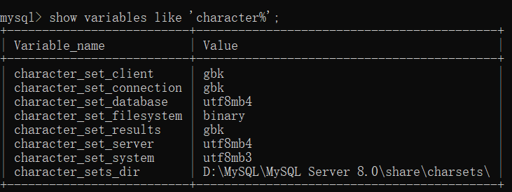
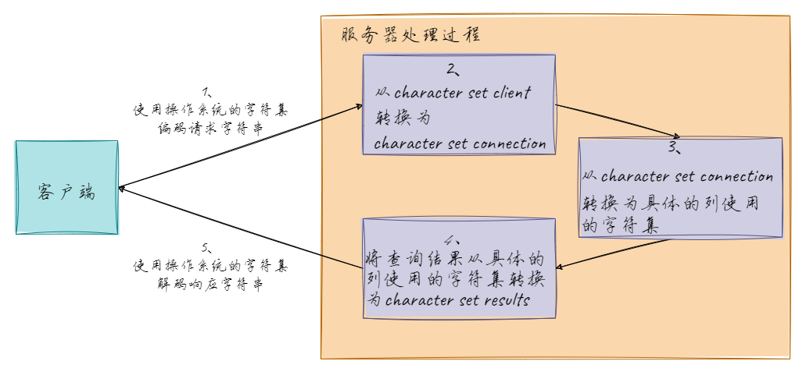

# 一、概述

### 1.数据库类型

关系型数据库（RDBMS）

### 2.通用语法及分类

- DDL：数据定义语言，用来定义数据库对象（数据库、表、字段）
- DML：数据操作语言，用来对数据库表中的数据进行增删改
- DQL：数据查询语言，用来查询数据库中表的记录
- DCL：数据控制语言，用来创建数据库用户、控制数据库的控制权限

# 二、DDL操作

### 1.数据库操作

##### 1.1 启动/停止/关闭数据库

```mysql
net start mysql
mysql -uroot -p123456

net stop mysql

exit;
```

##### 1.2 查询所有数据库

```mysql
SHOW DATABASES;
```

##### 1.3 查询当前数据库

```mysql
SELECT DATABASE();
```

##### 1.4 创建数据库

```mysql
#CREATE SCHEMA与CREATE DATABASE一样
CREATE DATABASE [ IF NOT EXISTS ] 数据库名 [ DEFAULT CHARSET 字符集] [COLLATE 排序规则 ];
```

**注意事项**

- **UTF8**字符集长度为**3**字节，**utf8mb4**字符集长度为**4**字节，所以推荐用**utf8mb4**
- **COLLATE**通常是和**CHARSET**（数据编码）相关的，一般来说
  - Latin1编码的默认COLLATE为latin1_swedish_ci
  - GBK编码的默认COLLATE为gbk_chinese_ci
  - utf8mb4编码的默认COLLATE为utf8mb4_general_ci
- **COLLATE**中的后缀

| 后缀 | 英文释义           | 描述             |
| ---- | ------------------ | ---------------- |
| _ai  | accent insensitive | 不区分重音       |
| _as  | accent sensitive   | 区分重音         |
| _ci  | case insensitive   | 不区分大小写     |
| _cs  | case sensitive     | 区分大小写       |
| _bin | binary             | 以二进制方式比较 |

- mysql的默认**CHARSET**与**COLLATE**
  - 在**mysql8.0以下**版本中，默认CHARSET为**Latin1**，默认COLLATE为**latin1_swedish_ci**
  - 从**mysql8.0**开始，默认CHARSET为**utf8mb4**，默认COLLATE为**utf8mb4_0900_ai_ci**

##### 1.5 修改数据库字符集

```mysql
ALTER DATABASE 数据库名 CHARACTER SET 字符集;
```

##### 1.6 删除数据库

```mysql
DROP DATABASE [ IF EXISTS ] 数据库名;
```

##### 1.7 使用数据库

```mysql
USE 数据库名;
```

### 2.表操作

##### 2.1 查询当前数据库所有表

```mysql
SHOW TABLES;
```

##### 2.2 查询表结构

```mysql
DESC 表名;
```

##### 2.3 查询指定表的建表语句

```mysql
SHOW CREATE TABLE 表名;
```

##### 2.4 创建表

`语法`

```mysql
#最后一个字段后面没有逗号
CREATE TABLE 表名(
    字段1 字段1类型 [COMMENT 字段1注释],
    字段2 字段2类型 [COMMENT 字段2注释],
    字段3 字段3类型 [COMMENT 字段3注释],    ...    字段n 字段n类型 [COMMENT 字段n注释])
    [ COMMENT 表注释 ];
```

`示例`

```mysql
create TABLE testuserss(
id INT PRIMARY KEY COMMENT '用户id',
name VARCHAR(64) NOT NULL COMMENT '姓名'
)ENGINE=InnoDB DEFAULT CHARSET=utf8 COMMENT='用户表';
```

##### 2.5 添加字段

`语法`

```mysql
ALTER TABLE 表名 ADD 字段名 类型(长度) [COMMENT 注释] [约束];
```

`示例`

```mysql
ALTER TABLE emp ADD nickname varchar(20) COMMENT '昵称';
```

##### 2.6 修改数据类型

`语法`

```mysql
ALTER TABLE 表名 MODIFY 字段名 新数据类型(长度);
```

`示例`

```mysql
ALTER TABLE emp MODIFY age INT;
```

##### 2.7 修改字段名和字段类型

`语法`

```mysql
ALTER TABLE 表名 CHANGE 旧字段名 新字段名 类型(长度) [COMMENT 注释] [约束];
```

`示例`

```mysql
ALTER TABLE emp CHANGE nickname username varchar(30) COMMENT '昵称';
```

##### 2.8 删除字段

```mysql
ALTER TABLE 表名 DROP 字段名;
```

##### 2.9 修改表名

```mysql
ALTER TABLE 表名 RENAME TO 新表名;
```

##### 2.10 删除表

```mysql
DROP TABLE [IF EXISTS] 表名;
```

##### 2.11 删除表，并重新创建该表

```mysql
TRUNCATE TABLE 表名;
```

### 3.各级别的字符集

##### 3.1 各级别字符集

MySQL有4个级别的字符集和比较规则，分别是：

- 服务器级别
- 数据库级别
- 表级别
- 列级别

执行如下SQL语句：

```mysql
show variables like 'character%';
```



- character_set_server：服务器级别的字符集
- character_set_database：当前数据库的字符集
- character_set_client：服务器解码请求时使用的字符集
- character_set_connection：服务器处理请求时会把请求字符串从character_set_client转为character_set_connection
- character_set_results：服务器向客户端返回数据时使用的字符集

##### 3.2 字符集读取




假设客户端发送的请求是下边这个字符串：

```mysql
SELECT * FROM t WHERE s = '我';
```

`3.1.1`

客户端发送请求所使用的字符集一般情况下客户端所使用的字符集和当前操作系统一致，不同操作系统使用的字符集可能不一样，如下：

- 类Unix系统使用的是utf8
- Windows使用的是gbk

当客户端使用的是utf8字符集，字符'我'在发送给服务器的请求中的字节形式就是：0xE68891

**注意事项**

如果使用的是**可视化工具**，比如navicat之类的，这些工具可能会**使用自定义的字符集来编码发送到服务器的字符串**，而不采用操作系统默认的字符集，所以在**尽量用命令行窗口**

`3.1.2`

服务器接收到客户端发送来的请求其实是一串二进制的字节，它会认为这串字节采用的字符集是character_set_client，然后把这串字节转换为character_set_connection字符集编码的字符

由于我的计算机上character_set_client的值是utf8，首先会按照utf8字符集对字节串0xE68891进行解码，得到的字符串就是'我'，然后按照character_set_connection代表的字符集，也就是gbk进行编码，得到的结果就是字节串0xCED2

`3.1.3`

因为表t的列col采用的是gbk字符集，与character_set_connection一致，所以直接到列中找字节值为0xCED2的记录，最后找到了一条记录

**注意事项**

如果某个列使用的字符集和character_set_connection代表的字符集不一致的话，还需要进行一次字符集转换

`3.1.4`

上一步骤找到的记录中的col列其实是一个字节串0xCED2，col列是采用gbk进行编码的，所以首先会将这个字节串使用gbk进行解码，得到字符串'我'，然后再把这个字符串使用character_set_results代表的字符集，也就是utf8进行编码，得到了新的字节串：0xE68891，然后发送给客户端

`3.1.5`

由于客户端是用的字符集是utf8，所以可以顺利的将0xE68891解释成字符'我'，从而显示到显示器上

##### 3.3 服务器级别

`character_set_server：服务器级别的字符集`

可以在启动服务器程序时通过启动选项或者在服务器程序运行过程中使用**SET**语句修改这两个变量的值

比如可以在配置文件中这样写：

```tex
[server]  
character_set_server=gbk # 默认字符集  
collation_server=gbk_chinese_ci # 对应的默认的比较规则
```

当服务器启动的时候读取这个配置文件后这两个系统变量的值便修改了

##### 3.4 数据库级别

`character_set_database ：当前数据库的字符集`

在创建和修改数据库的时候指定该数据库的字符集和比较规则

语法如下：

```mysql
CREATE DATABASE 数据库名  
    [[DEFAULT] CHARACTER SET 字符集名称]  
    [[DEFAULT] COLLATE 比较规则名称];  

ALTER DATABASE 数据库名  
    [[DEFAULT] CHARACTER SET 字符集名称]  
    [[DEFAULT] COLLATE 比较规则名称];
```

##### 3.5 表级别

在创建和修改表的时候指定表的字符集和比较规则

语法如下：

```mysql
CREATE TABLE 表名 (列的信息)  
    [[DEFAULT] CHARACTER SET 字符集名称]  
    [COLLATE 比较规则名称]]  

ALTER TABLE 表名  
    [[DEFAULT] CHARACTER SET 字符集名称]  
    [COLLATE 比较规则名称]
```

如果创建和修改**表**的语句中**没有指明**字符集和比较规则，将**使用该表所在数据库**的字符集和比较规则作为该表的字符集和比较规则

##### 3.6 列级别

对于存储字符串的列，同一个表中的不同的列也可以有不同的字符集和比较规则，在创建和修改列定义的时候可以指定该列的字符集和比较规则

语法如下：

```mysql
CREATE TABLE 表名(  
    列名 字符串类型 [CHARACTER SET 字符集名称] [COLLATE 比较规则名称],  
    其他列...  
);  

ALTER TABLE 表名 MODIFY 列名 字符串类型 [CHARACTER SET 字符集名称] [COLLATE 比较规则名称];
```

对于某个列来说，如果在创建和修改**列**的语句中**没有指明**字符集和比较规则，将**使用该列所在表**的字符集和比较规则作为该列的字符集和比较规则

##### 3.7 字符集比较规则

- 如果创建或修改列时没有显式的指定字符集和比较规则，则该列默认用表的字符集和比较规则
- 如果创建表时没有显式的指定字符集和比较规则，则该表 默认用数据库的字符集和比较规则
- 如果创建数据库时没有显式的指定字符集和比较规则，则该数据库默认用服务器的字符集和比较规则

`列实际数据存储空间大小比较`

比方说我们向表t中插入一条记录：

```mysql
mysql> INSERT INTO t(col) VALUES('张三');  
Query OK, 1 row affected (0.00 sec)  

mysql> SELECT * FROM t;  
+--------+  
| s
|
+--------+
| 张三
|
+--------+  
1 row in set (0.00 sec)
```

首先列col使用的字符集是**gbk**，**一个中文字符**在gbk中的编码为**0xCED2**，占用**2个字节**，**两个字符**的实际数据就占用**4个字节**。如果把该列的字符集修改为**utf8**的话，这两个字符就实际占用**6个字节**

**注意事项**

转换列的字符集时，如果**转换前的列**中存储的数据**不能**用**转换后的列**字符集进行表示会发生错误。如**原先列**使用的字符集是**utf8**，列中存储了一些汉字，**转换后列**的字符集转换为**ascii**的话就会出错，因为**ascii**字符集并**不能表示汉字字符**

##### 3.8 字符集常用设置操作

`常用操作1`

```mysql
-- 查看GBK字符集的比较规则  
SHOW COLLATION LIKE 'gbk%';  
-- 查看UTF-8字符集的比较规则  
SHOW COLLATION LIKE 'utf8%';
```

`常用操作2`

```mysql
-- 查看服务器的字符集和比较规则  
SHOW VARIABLES LIKE '%_server';  
-- 查看数据库的字符集和比较规则  
SHOW VARIABLES LIKE '%_database';  
-- 查看具体数据库的字符集  
SHOW CREATE DATABASE dbtest1;  
-- 修改具体数据库的字符集  
ALTER DATABASE dbtest1 DEFAULT CHARACTER SET 'utf8' COLLATE 'utf8_general_ci';
```

`常用操作3`

```mysql
-- 查看表的字符集  
show create table employees;  
-- 查看表的比较规则  
show table status from atguigudb like 'employees';  
-- 修改表的字符集和比较规则  
ALTER TABLE emp1 DEFAULT CHARACTER SET 'utf8' COLLATE 'utf8_general_ci';
```

# 三、DML操作

### 1.添加数据

##### 1.1 指定字段

```mysql
INSERT INTO 表名 (字段名1, 字段名2, ...) VALUES (值1, 值2, ...);
```

##### 1.2 全部字段

```mysql
INSERT INTO 表名 VALUES (值1, 值2, ...);
```

##### 1.3 批量添加数据

```mysql
INSERT INTO 表名 (字段名1, 字段名2, ...) VALUES (值1, 值2, ...), (值1, 值2, ...), (值1, 值2, ...);
INSERT INTO 表名 VALUES (值1, 值2, ...), (值1, 值2, ...), (值1, 值2, ...);
```

**注意事项**

- 字符串和日期类型数据应该包含在引号中
- 插入的数据大小应该在字段的规定范围内

### 2.更新和删除数据

##### 2.1 修改数据

```mysql
#update不加条件，更新表所有数据
UPDATE 表名 SET 字段名1 = 值1, 字段名2 = 值2, ... [ WHERE 条件 ];
```

##### 2.2 删除数据：

```mysql
#delete不加条件，删除表所有数据
DELETE FROM 表名 [ WHERE 条件 ];
```

# 四、DQL操作
