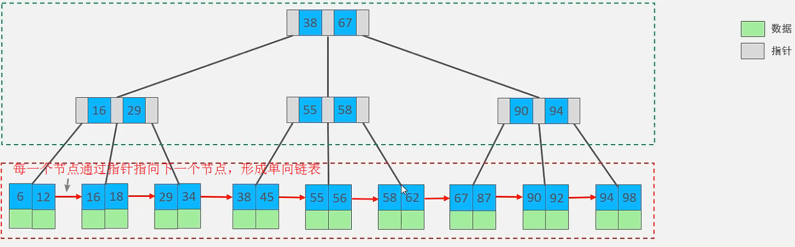
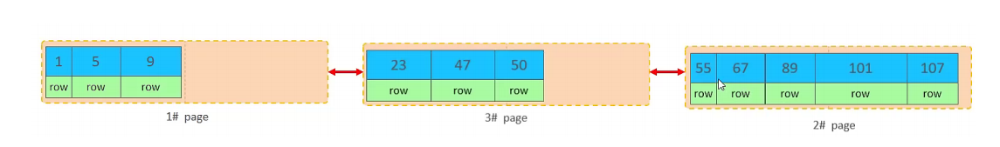
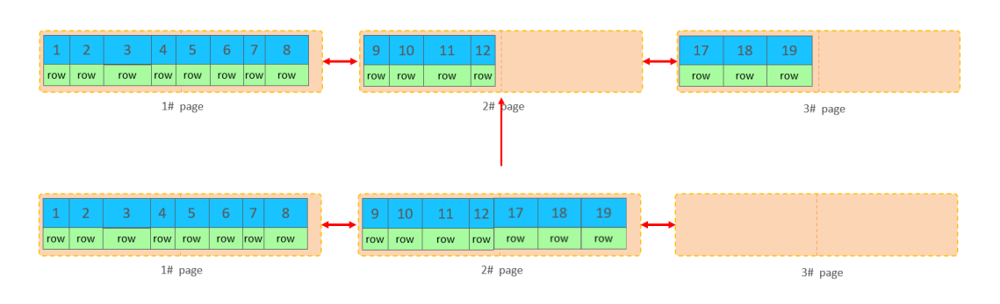
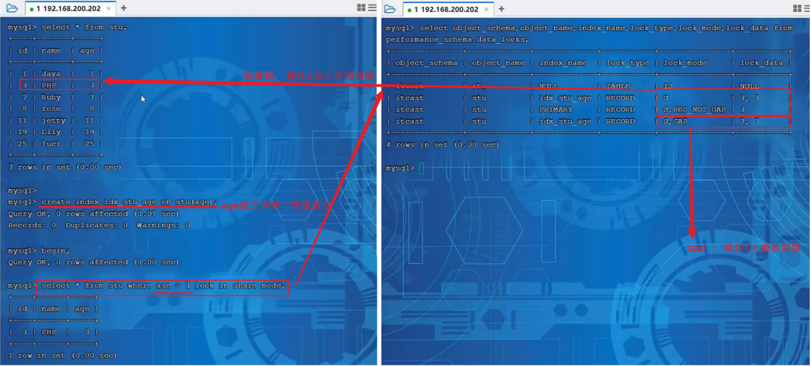
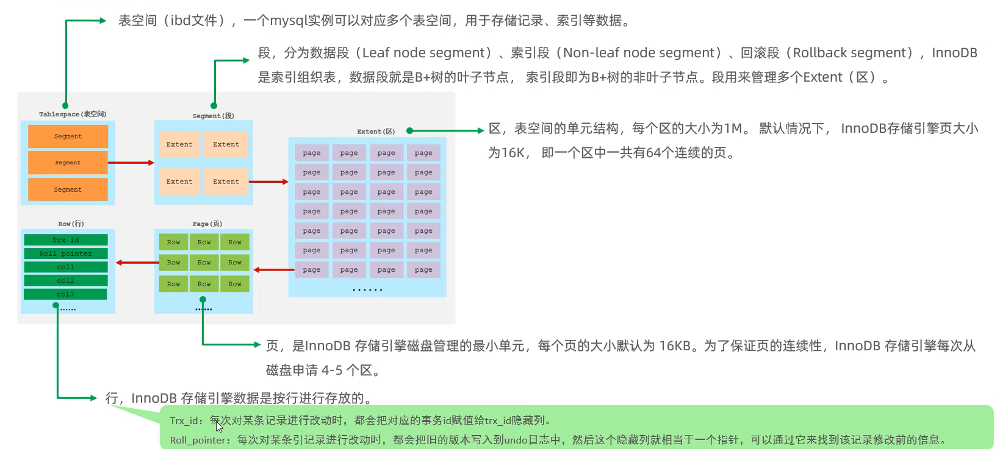
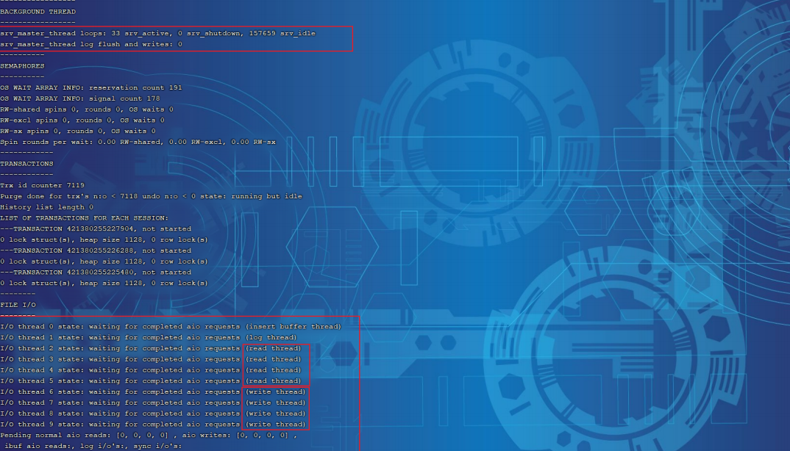

# 一、存储引擎

### 1.MySQL体系结构


##### 1.1 连接层

最上层是一些客户端和链接服务，包含本地sock通信和大多数基于客户端/服务端工具实现的类似于TCP/IP的通信。主要完成一些类似于连接处理、授权认证、及相关的安全方案。在该层上引入了线程池的概念，为通过认证安全接入的客户端提供线程。同样在该层上可以实现基于SSL的安全链接。服务器也会为安全接入的每个客户端验证它所具有的操作权限

##### 1.2 服务层

第二层架构主要完成大多数的核心服务功能，如SQL接口，并完成缓存的查询，SQL的分析和优化，部分内置函数的执行。所有跨存储引擎的功能也在这一层实现，如 过程、函数等。在该层，服务器会解析查询并创建相应的内部解析树，并对其完成相应的优化如确定表的查询的顺序，是否利用索引等，最后生成相应的执行操作。如果是select语句，服务器还会查询内部的缓存，如果缓存空间足够大，这样在解决大量读操作的环境中能够很好的提升系统的性能

##### 1.3 引擎层

存储引擎层， 存储引擎真正的负责了MySQL中数据的存储和提取，服务器通过API和存储引擎进行通信。不同的存储引擎具有不同的功能，这样我们可以根据自己的需要，来选取合适的存储引擎。数据库中的索引是在存储引擎层实现的

##### 1.4 存储层

数据存储层， 主要是将数据(如: redolog、undolog、数据、索引、二进制日志、错误日志、查询日志、慢查询日志等)存储在文件系统之上，并完成与存储引擎的交互。和其他数据库相比，MySQL有点与众不同，它的架构可以在多种不同场景中应用并发挥良好作用。主要体现在存储引擎上，插件式的存储引擎架构，将查询处理和其他的系统任务以及数据的存储提取分离。这种架构可以根据业务的需求和实际需要选择合适的存储引擎

### 2.存储引擎介绍

##### 2.1 概述

存储引擎就是存储数据、建立索引、更新/查询数据等技术的实现方式。存储引擎是基于表而不是基于库的，所以存储引擎也可以被称为表引擎。MySQL5.5后默认存储引擎是InnoDB

##### 2.2 相关语法操作

```mysql
-- 查询建表语句
show create table account;

-- 建表时指定存储引擎
CREATE TABLE 表名(
    ...
) ENGINE=INNODB;

-- 查看当前数据库支持的存储引擎
show engines;
```

### 3.常用存储引擎

##### 3.1 InnoDB

InnoDB是一种兼顾高可靠性和高性能的通用存储引擎，在**MySQL5.5**之后，InnoDB 是默认的MySQL引擎

`特点`

- DML 操作遵循 ACID 模型，支持**事务**
- **行级锁**，提高并发访问性能
- 支持**外键**约束，保证数据的完整性和正确性

`文件`

- xxx.ibd: xxx代表表名，InnoDB 引擎的每张表都会对应这样一个表空间文件，存储该表的表结构（frm、sdi）、数据和索引

`相关操作`

```mysql
-- 查看Mysql变量
-- innodb_file_per_table，决定多张表共享一个表空间还是每张表对应一个表空间
show variables like 'innodb_file_per_table';

-- 从idb文件提取表结构数据（在cmd运行）
ibd2sdi xxx.ibd
```

`InnoDB 逻辑存储结构`


##### 3.2 MyISAM

MyISAM 是 MySQL 早期的默认存储引擎

`特点`

- 不支持事务，不支持外键
- 支持表锁，不支持行锁
- 访问速度快

`文件`

- xxx.sdi: 存储表结构信息
- xxx.MYD: 存储数据
- xxx.MYI: 存储索引

##### 3.3 Memory

Memory 引擎的表数据是存储在内存中的，受硬件问题、断电问题的影响，只能将这些表作为临时表或缓存使用

`特点`

- 存放在内存中，速度快
- hash索引（默认）

`文件`

- xxx.sdi: 存储表结构信息

##### 3.4 存储引擎特点

| 特点         | InnoDB              | MyISAM | Memory |
| :----------- | :------------------ | :----- | :----- |
| 存储限制     | 64TB                | 有     | 有     |
| 事务安全     | 支持                | -      | -      |
| 锁机制       | 行锁                | 表锁   | 表锁   |
| B+tree索引   | 支持                | 支持   | 支持   |
| Hash索引     | -                   | -      | 支持   |
| 全文索引     | 支持（5.6版本之后） | 支持   | -      |
| 空间使用     | 高                  | 低     | N/A    |
| 内存使用     | 高                  | 低     | 中等   |
| 批量插入速度 | 低                  | 高     | 高     |
| 支持外键     | 支持                | -      | -      |

##### 3.5 存储引擎的选择

`InnoDB` 

如果应用对**事物的完整性有比较高的要求**，在并发条件下要求数据的一致性，数据操作除了插入和查询之外，还**包含很多的更新、删除操作**，则选择InnoDB

`MyISAM`

如果应用是以**读操作和插入操作为主**，只有很少的更新和删除操作，并且对**事务的完整性、并发性要求不高**，那选择这个存储引擎

`Memory`

将所有数据保存在内存中，访问速度快，通常用于**临时表及缓存**。Memory的缺陷是对表的大小有限制，太大的表无法缓存在内存中，而且无法保障数据的安全性

**注意事项**

- 电商中的足迹和评论适合使用MyISAM引擎，缓存适合使用Memory引擎
- MyISAM一般用MongoDB替代
- Memory一般用Redis替代

# 二、索引

### 1.索引概述

索引是帮助MySQL**高效获取数据的数据结构（有序）**。在数据之外，数据库系统还维护着满足特定查找算法的数据结构，这些数据结构以某种方式引用（指向）数据，这样就可以在这些数据结构上实现高级查询算法，这种数据结构就是索引

优点：

- 提高数据检索效率，降低数据库的IO成本
- 通过索引列对数据进行排序，降低数据排序的成本，降低CPU的消耗

缺点：

- 索引列也是要占用空间的
- 索引大大提高了查询效率，但降低了更新的速度，比如 INSERT、UPDATE、DELETE

### 2.索引结构

##### 2.1 概述

| 索引结构            | 描述                                                         |
| :------------------ | :----------------------------------------------------------- |
| B+Tree              | 最常见的索引类型，大部分引擎都支持B+树索引                   |
| Hash                | 底层数据结构是用哈希表实现，只有精确匹配索引列的查询才有效，不支持范围查询 |
| R-Tree(空间索引)    | 空间索引是 MyISAM 引擎的一个特殊索引类型，主要用于地理空间数据类型，通常使用较少 |
| Full-Text(全文索引) | 是一种通过建立倒排索引，快速匹配文档的方式，类似于 Lucene, Solr, ES |

| 索引       | InnoDB        | MyISAM | Memory |
| :--------- | :------------ | :----- | :----- |
| B+Tree索引 | 支持          | 支持   | 支持   |
| Hash索引   | 不支持        | 不支持 | 支持   |
| R-Tree索引 | 不支持        | 支持   | 不支持 |
| Full-text  | 5.6版本后支持 | 支持   | 不支持 |

##### 2.2 二叉树


`二叉树缺点`

- 顺序插入时，会形成一个链表，查询性能大大降低
- 大数据量情况下，层级较深，检索速度慢

**二叉树的缺点可以用红黑树来解决**


`红黑树缺点`

- 大数据量情况下，层级较深，检索速度慢的问题。

##### 2.3 B-Tree

B-Tree (多路平衡查找树) 以一棵**最大度数**（max-degree，指一个节点的子节点个数）为**5**的b-tree为例（每个节点最多存储**4个key**，**5个指针**）


> 演示地址：https://www.cs.usfca.edu/~galles/visualization/BTree.html

**注意事项**

- B-Tree树满元素中间元素向上分裂

##### 2.4 B+Tree



> 演示地址：https://www.cs.usfca.edu/~galles/visualization/BPlusTree.html

`与B-Tree的区别`

- 所有的数据都会出现在叶子节点
- 叶子节点形成一个单向链表

MySQL索引数据结构对经典的 B+Tree 进行了优化。在原B+Tree的基础上，增加一个指向相邻叶子节点的链表指针，就形成了带有顺序指针的B+Tree，提高区间访问的性能


##### 2.5 Hash

哈希索引就是采用一定的hash算法，将键值换算成新的hash值，映射到对应的槽位上，然后存储在hash表中。如果两个（或多个）键值，映射到一个相同的槽位上，他们就产生了hash冲突（也称为hash碰撞），可以通过链表来解决


`特点`

- Hash索引只能用于对等比较（=、in），不支持范围查询（betwwn、>、<、…）
- 无法利用索引完成排序操作
- 查询效率高，通常只需要一次检索就可以了，效率通常要高于B+Tree索引

`存储引擎支持`

- Memory
- InnoDB: 具有自适应hash功能，hash索引是存储引擎根据B+Tree 索引在指定条件下自动构建的

##### 2.6 面试题

为什么InnoDB存储引擎选择使用B+Tree索引结构？

- 相对于二叉树，层级更少，搜索效率高
- 对于B-Tree，无论是叶子节点还是非叶子节点，都会保存数据，这样导致一页中存储的键值减少，指针也跟着减少，要同样保存大量数据，只能增加树的高度，导致性能降低
- 相对于Hash索引，B+Tree支持范围匹配及排序操作

### 3.索引分类

##### 3.1 一般形式索引分类

| 分类     | 含义                                                 | 特点                     | 关键字   |
| :------- | :--------------------------------------------------- | :----------------------- | :------- |
| 主键索引 | 针对于表中主键创建的索引                             | 默认自动创建，只能有一个 | PRIMARY  |
| 唯一索引 | 避免同一个表中某数据列中的值重复                     | 可以有多个               | UNIQUE   |
| 常规索引 | 快速定位特定数据                                     | 可以有多个               |          |
| 全文索引 | 全文索引查找的是文本中的关键词，而不是比较索引中的值 | 可以有多个               | FULLTEXT |

##### 3.2 存储形式索引分类

在**InnoDB**存储引擎中，根据索引的**存储形式**，又可以分为以下两种

| 分类                      | 含义                                                       | 特点                 |
| :------------------------ | :--------------------------------------------------------- | :------------------- |
| 聚集索引(Clustered Index) | 将数据存储与索引放一块，索引结构的叶子节点保存了行数据     | 必须有，而且只有一个 |
| 二级索引(Secondary Index) | 将数据与索引分开存储，索引结构的叶子节点关联的是对应的主键 | 可以存在多个         |

`聚集、二级索引原理`


`回表查询`


`聚集索引选取规则`

- 如果存在主键，主键索引就是聚集索引
- 如果不存在主键，将使用第一个唯一(UNIQUE)索引作为聚集索引
- 如果表没有主键或没有合适的唯一索引，则InnoDB会自动生成一个rowid作为隐藏的聚集索引

##### 3.3 思考题

`以下 SQL 语句，哪个执行效率高？为什么？`

```mysql
-- 备注：id为主键，name字段创建的有索引
select * from user where id = 10;
select * from user where name = 'Arm';
```

答：第一条语句，因为第二条需要回表查询，相当于两个步骤p

` InnoDB 主键索引的 B+Tree 高度为多少？`

答：假设一行数据大小为1k，一页中可以存储16行这样的数据。InnoDB 的指针占用6个字节的空间，主键假设为bigint，占用字节数为8，因此可得：`n * 8 + (n+1) * 6 = 16 * 1024`，其中8表示bigint占用的字节数，n表示当前节点存储的key的数量，(n + 1)表示指针数量（比key多一个），算出n约为1170，指针为1171

如果树的高度为2，那么他能存储的数据量大概为：`1171 * 16 = 18736`
如果树的高度为3，那么他能存储的数据量大概为：`1171 * 1171 * 16 = 21939856`

### 4.索引语法

`创建索引`

```mysql
-- 如果不加CREATE后面不加索引类型参数，则创建的是常规索引
CREATE [UNIQUE|FULLTEXT] INDEX index_name ON table_name(index_col_name, ...);
```

`查看索引`

```mysql
SHOW INDEX FROM table_name;
SHOW INDEX FROM table_name\G; #列变成行，更直接
```

`删除索引`

```mysql
DROP INDEX index_name ON table_name;
```

### 5.SQL性能分析

##### 5.1 SQL执行频率

```mysql
-- session 是查看当前会话 ;
-- global 是查询全局数据 ;
SHOW GLOBAL STATUS LIKE 'Com_______';
```


##### 5.2 慢日志查询

慢查询日志记录了所有执行时间超过指定参数（long_query_time，单位：秒，默认10秒）的所有SQL语句的日志，MySQL的慢查询日志默认没有开启，可以通过slow_query_log查询是否开启

```mysql
show variables like 'slow_query_log'
```

`开启慢查询日志`

配置MySQL的配置文件**（/etc/my.cnf）**：

```shell
# 开启MySQL慢日志查询开关
slow_query_log=1

# 设置慢日志的时间为2秒，SQL语句执行时间超过2秒，就会视为慢查询，记录慢查询日志
long_query_time=2

# 重启mysql
systemctl restart mysqld
```

`查询慢查询日志`

```shell
cd /var/lib/mysql

cat localhost-slow.log
tail -f localhost-slow.log #实时记录
```


##### 5.3 profile详情

`开启profile`

```mysql
-- 查询当前MySQL是否支持profile操作
SELECT @@have_profiling;

-- 查询profile是否开启
SELECT @@profiling;

-- 开启profiling
SET profiling = 1;
```

`查看指令耗时`

```mysql
-- 查看每一条SQL的耗时基本情况
show profiles;

-- 查看指定query_id的SQL语句各个阶段的耗时情况
show profile for query query_id;

-- 查看指定query_id的SQL语句CPU的使用情况
show profile cpu for query query_id;
```

**SQL耗时**


**具体ID的SQL的各阶段耗时**


##### 5.4 explain

`概述`

EXPLAIN或者DESC命令获取MySQL**如何执行SELECT语句**的信息，包括在SELECT语句执行过程中**表如何连接和连接的顺序**

`语法`

```mysql
-- 直接在select语句之前加上关键字 explain / desc
EXPLAIN SELECT 字段列表 FROM 表名 WHERE 条件 ;
```

`Explain 执行计划中各个字段的含义`

| 字段         | 含义                                                         |
| ------------ | ------------------------------------------------------------ |
| id           | select查询的序列号，表示查询中执行select子句或者是操作表的顺序(**id相同，执行顺序从上到下；id不同，值越大，越先执行**) |
| select_type  | 表示SELECT的类型，常见的取值有**SIMPLE**（简单表，即不使用表连接或者子查询）、**PRIMARY**（主查询，即外层的查询）、**UNION**（UNION 中的第二个或者后面的查询语句）、**SUBQUERY**（SELECT/WHERE之后包含了子查询）等 |
| type         | 表示连接类型，性能由好到差的连接类型为**NULL、system、const、eq_ref、ref、range、 index、all** |
| possible_key | 显示可能应用在这张表上的索引，一个或多个                     |
| key          | 实际使用的索引，如果为NULL，则没有使用索引                   |
| key_len      | 表示索引中使用的字节数， 该值为索引字段最大可能长度，并非实际使用长度，在不损失精确性的前提下， 长度**越短越好** |
| rows         | MySQL认为必须要执行查询的行数，在innodb引擎的表中，是一个**估计值**，可能并不总是准确的 |
| filtered     | 表示返回结果的行数占需读取行数的百分比，filtered的值**越大越好** |

### 6.索引使用

##### 6.1 最左前缀法则

如果索引关联了多列（联合索引），要遵守最左前缀法则，最左前缀法则指的是查询从索引的最左列开始，并且不跳过索引中的列。
如果跳跃某一列，索引将部分失效（后面的字段索引失效）

联合索引中，出现范围查询（<, >），范围查询右侧的列索引失效。可以用>=或者<=来规避索引失效问题。

`索引失效情况`

- 在索引列上进行运算操作，索引将失效。如：`explain select * from tb_user where substring(phone, 10, 2) = '15';`
- 字符串类型字段使用时，不加引号，索引将失效。如：`explain select * from tb_user where phone = 17799990015;`
- 模糊查询中，如果仅仅是尾部模糊匹配，索引不会是失效；如果是头部模糊匹配，索引失效。如：`explain select * from tb_user where profession like '%工程';`，前后都有%也会失效
- 用**or**分割开的条件，如果**or**其中一个条件的列没有索引，那么涉及的索引都不会被用到
- 如果MySQL评估使用索引比全表更慢，则不使用索引

##### 6.2 SQL 提示

是优化数据库的一个重要手段，简单来说，就是在SQL语句中加入一些人为的提示来达到优化操作的目的。

```mysql
-- 使用索引
explain select * from tb_user use index(idx_user_pro) where profession="软件工程";

-- 不使用哪个索引
explain select * from tb_user ignore index(idx_user_pro) where profession="软件工程";

-- 必须使用哪个索引
explain select * from tb_user force index(idx_user_pro) where profession="软件工程";
```

- use是建议，实际使用哪个索引MySQL还会自己权衡运行速度去更改，force就是无论如何都强制使用该索引

##### 6.3 覆盖索引&回表查询

尽量使用覆盖索引（查询使用了索引，并且需要返回的列，在该索引中已经全部能找到），**减少select ***

`explain中extra字段含义`
**using index condition**：查找使用了索引，但是需要回表查询数据
**using where; using index**：查找使用了索引，但是需要的数据都在索引列中能找到，所以不需要回表查询

`减少回表查询`

如果在聚集索引中直接能找到对应的行，则直接返回行数据，只需要一次查询，哪怕是select *；如果在辅助索引中找聚集索引，如**select id, name from xxx where name='xxx';**也只需要通过辅助索引(name)查找到对应的id，返回name和name索引对应的id即可，只需要一次查询；如果是通过辅助索引查找其他字段，则需要回表查询，如**select id, name, gender from xxx where name='xxx';**

- 尽量不要用**select ***，容易出现回表查询，降低效率，除非有联合索引包含了所有字段

`面试题`

一张表，有四个字段（id, username, password, status），由于数据量大，需要对以下SQL语句进行优化，该如何进行才是最优方案：
**select id, username, password from tb_user where username='itcast';**

解：给**username**和password字段建立**联合索引**，则不需要回表查询，直接覆盖索引

##### 6.4 前缀索引

`概述`

当字段类型为字符串（varchar, text等）时，有时候需要索引很长的字符串，这会让索引变得很大，查询时，浪费大量的磁盘IO，影响查询效率，此时可以只降字符串的一部分前缀，建立索引，这样可以大大节约索引空间，从而提高索引效率。

`语法`

```mysql
create index idx_xxxx on table_name(columnn(n));
```

`求选择性`

前缀长度：可以根据索引的选择性来决定，而选择性是指不重复的索引值（基数）和数据表的记录总数的比值，索引选择性越高则查询效率越高，唯一索引的选择性是1，这是最好的索引选择性，性能也是最好的

```mysql
select count(distinct email) / count(*) from tb_user;

select count(distinct substring(email, 1, 5)) / count(*) from tb_user;
```

- show index 里面的sub_part可以看到接取的长度


`前缀索引结构`


##### 6.5 单列索引&联合索引

单列索引：即一个索引只包含单个列
联合索引：即一个索引包含了多个列
在业务场景中，如果存在多个查询条件，考虑针对于查询字段建立索引时，建议建立联合索引，而非单列索引。

`单列索引情况`

```mysql
-- 这句只会用到phone索引字段
explain select id, phone, name from tb_user where phone = '17799990010' and name = '韩信';
```

**注意事项**

- 多条件联合查询时，MySQL优化器会评估哪个字段的索引效率更高，会选择该索引完成本次查询

### 7.索引设计原则

- 针对于数据量较大，且查询比较频繁的表建立索引
- 针对于常作为查询条件（where）、排序（order by）、分组（group by）操作的字段建立索引
- 尽量选择区分度高的列作为索引，尽量建立唯一索引，区分度越高，使用索引的效率越高
- 如果是字符串类型的字段，字段长度较长，可以针对于字段的特点，建立前缀索引
- 尽量使用联合索引，减少单列索引，查询时，联合索引很多时候可以覆盖索引，节省存储空间，避免回表，提高查询效率
- 要控制索引的数量，索引并不是多多益善，索引越多，维护索引结构的代价就越大，会影响增删改的效率
- 如果索引列不能存储NULL值，请在创建表时使用NOT NULL约束它。当优化器知道每列是否包含NULL值时，它可以更好地确定哪个索引最有效地用于查询

# 三、SQL优化

### 1.插入数据

##### 1.1 普通插入

- 采用批量插入（一次插入的数据不建议超过1000条）
- 手动提交事务
- 主键顺序插入

##### 1.2 大批量插入

如果一次性需要插入大批量数据，使用insert语句插入性能较低，此时可以使用MySQL数据库提供的load指令插入。

```mysql
# 客户端连接服务端时，加上参数 --local-infile（这一行在bash/cmd界面输入）
mysql --local-infile -u root -p

# 设置全局参数local_infile为1，开启从本地加载文件导入数据的开关
set global local_infile = 1;
select @@local_infile;

# 执行load指令将准备好的数据，加载到表结构中
load data local infile '/root/sql1.log' into table 'tb_user' fields terminated by ',' lines terminated by '\n';
```

### 2.主键优化

##### 2.1 数据组织方式

在InnoDB存储引擎中，表数据都是根据主键顺序组织存放的，这种存储方式的表称为索引组织表

##### 2.2 页分裂

`概述`

页可以为空，也可以填充一半，也可以填充100%，每个页包含了2-N行数据（如果一行数据过大，会行溢出），根据主键排列

`主键乱序插入过程`

假如1#,2#页都已经写满了，存放了如图所示的数据，并再插入一条id为50的数据


不会开辟新的页将id为50的数据写入


此时会开辟一个新的页 3#，并不会直接将50存入3#页，而是会将1#页后一半的数据，移动到3#页，然后在3#页，插入50


移动数据，并插入id为50的数据之后，这三个页之间的数据顺序存在问题的。 1#的下一个页应该是3#， 3#的下一个页是2#。 所以需要重新设置链表指针



##### 2.3 页合并

`概述`

当删除一行记录时，实际上记录并没有被物理删除，只是记录被标记（flaged）为删除并且它的空间变得允许被其他记录声明使用。当页中删除的记录到达MERGE_THRESHOLD（默认为页的50%），InnoDB会开始寻找最靠近的页（前后）看看是否可以将这两个页合并以优化空间使用。

**MERGE_THRESHOLD：合并页的阈值，可以自己设置，在创建表或创建索引时指定**

`删除数据页合并过程`

删除页中的记录达到 MERGE_THRESHOLD（默认为页的50%）


InnoDB开始寻找最靠近的页（前或后）看看是否可以将两个页合并以优化空间使用



删除数据，并将页合并之后，再次插入新的数据20则直接插入3#页


##### 2.4 主键设计原则

- 满足业务需求的情况下，尽量降低主键的长度
- 插入数据时，尽量选择顺序插入，选择使用AUTO_INCREMENT自增主键
- 尽量不要使用UUID做主键或者是其他的自然主键，如身份证号
- 业务操作时，避免对主键的修改

### 3.order by优化

##### 3.1  order by优化extra信息概述

`Using filesort`

通过表的索引或全表扫描，读取满足条件的数据行，然后在排序缓冲区sort buffer中完成排序操作

`Using index`

通过有序索引顺序扫描直接返回有序数据，这种情况即为using index，不需要额外排序，操作效率高

##### 3.2 order by优化索引创建示例

```mysql
create index idx_user_age_phone_ad on tb_user(age asc, phone desc);
```

##### 3.3 order by优化索引设计原则

- 根据排序字段建立合适的索引，多字段排序时，也遵循最左前缀法则
- 尽量使用覆盖索引
- 多字段排序，一个升序一个降序，此时需要注意联合索引在创建时的规则（ASC/DESC）
- 如果不可避免出现filesort，大数据量排序时，可以适当增大排序缓冲区大小 sort_buffer_size（默认256k）

### 4.group by优化

- 在分组操作时，可以通过索引来提高效率
- 分组操作时，索引的使用也是满足最左前缀法则的

### 5.limit优化

常见的问题如**limit 2000000, 10**，此时需要 MySQL 排序前2000000条记录，但仅仅返回**2000000 - 2000010**的记录，**其他记录丢弃**，查询排序的代价非常大。
优化方案：一般分页查询时，通过创建覆盖索引能够比较好地提高性能，可以通过**覆盖索引加子查询**形式进行优化

### 6.count优化

##### 6.1 count概述

- MyISAM引擎把一个表的总行数存在了磁盘上，因此执行 `count(*)` 的时候会直接返回这个数，效率很高（前提是不适用where
- InnoDB 在执行`count(*)` 时，需要把数据一行一行地从引擎里面读出来，然后累计计数
- 优化方案：自己计数，如创建key-value表存储在内存或硬盘，或者是用redis

##### 6.2 count的用法

| 含义        | 用法                                                         |
| ----------- | ------------------------------------------------------------ |
| count(主键) | InnoDB引擎会遍历整张表，把每行的主键id值都取出来，返回给服务层，服务层拿到主键后，直接按行进行累加（主键不可能为空） |
| count(字段) | 没有not null约束的话，InnoDB引擎会遍历整张表把每一行的字段值都取出来，返回给服务层，服务层判断是否为null，不为null，计数累加；有not null约束的话，InnoDB引擎会遍历整张表把每一行的字段值都取出来，返回给服务层，直接按行进行累加 |
| count(1)    | InnoDB引擎遍历整张表，但不取值。服务层对于返回的每一层，放一个数字 1 进去，直接按行进行累加 |
| count(*)    | InnoDB 引擎并不会把全部字段取出来，而是专门做了优化，不取值，服务层直接按行进行累加 |

##### 6.3 count的效率排序

count(字段) < count(主键) < count(1) < count(*)

### 7.update优化（避免行锁升级为表锁）

InnoDB的行锁是针对索引加的锁，不是针对记录加的锁，并且该索引不能失效，否则会从行锁升级为表锁

```mysql
-- 如以下两条语句：
update student set no = '123' where id = 1; #这句由于id有主键索引，所以只会锁这一行；
update student set no = '123' where name = 'test'; #这句由于name没有索引，所以会把整张表都锁住进行数据更新
```

- 解决方法是给name字段添加索引

# 四、视图

### 1.概述

视图（View）是一种**虚拟存在**的表。视图中的**数据并不在数据库中实际存在**，行和列数据来自定义视图的查询中使用的表，并且是在使用视图时**动态生成**的，即视图只保存了查询的**SQL逻辑**，不保存查询结果。

### 2.语法

##### 2.1 创建

```mysql
CREATE [OR REPLACE] VIEW 视图名称[(列名列表)] AS SELECT语句 [ WITH [ CASCADED | LOCAL ] CHECK OPTION ]
```

##### 2.2 查询

```mysql
-- 查看创建视图语句
SHOW CREATE VIEW 视图名称;

-- 查看视图数据
SELECT * FROM 视图名称;
```

##### 2.3 修改

```mysql
-- 方式一
CREATE [OR REPLACE] VIEW 视图名称[(列名列表)] AS SELECT语句 [ WITH [ CASCADED | LOCAL ] CHECK OPTION ]
-- 方式二
ALTER VIEW 视图名称[(列名列表)] AS SELECT语句 [ WITH [ CASCADED | LOCAL ] CHECK OPTION ]
```

##### 2.4 删除

```mysql
DROP VIEW [IF EXISTS] 视图名称 [,视图名称] ...;
```

### 3.检查选项

当使用**WITH CHECK OPTION**子句创建视图时，MySQL会通过视图检查正在更改的每个行，例如 插入，更新，删除，以使其符合视图的定义。 MySQL允许基于另一个视图创建视图，它还会检查依赖视图中的规则以保持**一致性**。为了确定检查的范围，mysql提供了两个选项： **CASCADED**和**LOCAL**，默认值为**CASCADED**

##### 3.1 CASCADED（级联）

比如，v2视图是基于v1视图的，如果在v2视图创建的时候指定了检查选项为cascaded，但是v1视图创建时未指定检查选项。 则在执行检查时，不仅会检查v2，还会级联检查v2的关联视图v1


##### 3.2 LOCAL（本地）

比如，v2视图是基于v1视图的，如果在v2视图创建的时候指定了检查选项为 local ，但是v1视图创建时未指定检查选项。 则在执行检查时，知会检查v2，不会检查v2的关联视图v1


### 4.视图的更新

要使视图可更新，**视图中的行**与**基础表中的**行之间必须存在**一对一**的关系。如果视图包含以下任何一项，则该视图不可更新：

- 聚合函数或窗口函数（SUM()、 MIN()、 MAX()、 COUNT()等）
- DISTINCT
- GROUP BY
- HAVING
- UNION 或者 UNION ALL

### 5.视图作用

##### 5.1 简单

视图不仅可以简化用户对数据的理解，也可以简化用户的操作。那些被经常使用的查询可以被定义为视图，从而使得用户不必为以后的操作每次指定全部的条件

##### 5.2 安全

数据库可以授权，但不能授权到数据库特定行和特定的列上。通过视图用户只能查询和修改他们所能见到的数据

##### 5.3 数据独立

视图可帮助用户屏蔽真实表结构变化带来的影响。

### 6.案例

##### 6.1 屏蔽字段

为了保证数据库表的安全性，开发人员在操作tb_user表时，只能看到的用户的基本字段，屏蔽手机号和邮箱两个字段。

```mysql
create view tb_user_view as select id,name,profession,age,gender,status,createtime from tb_user;

select * from tb_user_view;
```

##### 6.2 三表联查

查询每个学生所选修的课程（三张表联查），这个功能在很多的业务中都有使用到，为了简化操作，定义一个视图

```mysql
create view tb_stu_course_view as
select s.name student_name,s.no student_no,c.name course_name from student s,student_course sc,course c where s.id = sc.studentid and sc.courseid = c.id;

select * from tb_stu_course_view;
```

# 五、存储过程

### 1.介绍

##### 1.1 概述

存储过程是事先经过编译并存储在数据库中的一段**SQL语句的集合**，调用存储过程可以简化工作量，减少数据在数据库和应用服务器之间的传输，提高数据处理的效率

##### 1.2 特点

- 封装，复用：可以把某一业务SQL封装在存储过程中，使用时直接调用

- 接收参数，返回数据 ：存储过程中，传递参数或接收返回值

- 减少网络交互，提升效率 ： 当执行多条SQL时，每执行一次都是一次网络传输。 如果封装在存储过程中，只需要网络交互一次即可

### 2.语法

##### 2.1 创建

```mysql
CREATE PROCEDURE 存储过程名称 ([ 参数列表 ])
BEGIN
-- SQL语句
END ;
```

##### 2.2 调用

```mysql
CALL 名称 ([ 参数 ]);
```

##### 2.3 查看

```mysql
-- 查询指定数据库的存储过程及状态信息
SELECT * FROM INFORMATION_SCHEMA.ROUTINES WHERE ROUTINE_SCHEMA = 'xxx';

-- 查询某个存储过程的定义
SHOW CREATE PROCEDURE 存储过程名称 ;
```

##### 2.4 删除

```mysql
DROP PROCEDURE [ IF EXISTS ] 存储过程名称;
```

##### 2.5 示例

```mysql
-- 存储过程基本语法
-- 创建
create procedure p1()
begin
select count(*) from student;
end;

-- 调用
call p1();

-- 查看
select * from information_schema.ROUTINES where ROUTINE_SCHEMA = 'itcast';
show create procedure p1;

-- 删除
drop procedure if exists p1;
```

**注意事项**

- 在命令行中，执行创建存储过程的SQL时，需要通过关键字**delimiter**指定SQL语句的**结束符**（将**;**指定为其他符合如$$）

### 3.变量

##### 3.1 系统变量

`概述`

系统变量分为全局变量（**GLOBAL**）、会话变量（**SESSION**）

- 全局变量针对于所有的会话
- 会话变量针对于单个会话，在另外一个会话窗口不生效

`语法`

```mysql
-- 查看系统变量
SHOW [ SESSION | GLOBAL ] VARIABLES; #查看所有系统变量
SHOW [ SESSION | GLOBAL ] VARIABLES LIKE '......'; #可以通过LIKE模糊匹配方式查找变量
SELECT @@[SESSION | GLOBAL] 系统变量名; #查看指定变量的值

-- 设置系统变量
SET [ SESSION | GLOBAL ] 系统变量名 = 值;
SET @@[SESSION | GLOBAL]系统变量名 = 值;
```

`示例`

```mysql
-- 查看系统变量
show session variables ;
show session variables like 'auto%';
show global variables like 'auto%';
select @@global.autocommit;
select @@session.autocommit;

-- 设置系统变量
set session autocommit = 1;
insert into course(id, name) VALUES (6, 'ES');
set global autocommit = 0;
select @@global.autocommit;
```

**注意事项**

- 如果没有指定SESSION/GLOBAL，默认是SESSION，会话变量
- mysql服务重新启动之后，所设置的全局参数会失效，要想不失效，需要在/etc/my.cnf中配置参数

##### 3.2 用户变量

`概述`

用户变量不用提前声明，使用时直接**@变量名**即可，作用域为当前会话

`语法`

```mysql
-- 赋值
SET @var_name = expr [, @var_name = expr] ... ;
SET @var_name := expr [, @var_name := expr] ... ;
SELECT 字段名 INTO @var_name FROM 表名;

-- 使用
SELECT @var_name ;
```

- 用户定义的变量无需对其进行声明或初始化，只不过获取到的值为NULL

`示例`

```mysql
-- 赋值
set @myname = 'itcast';
set @myage := 10;
set @mygender := '男',@myhobby := 'java';
select @mycolor := 'red';
select count(*) into @mycount from tb_user;

-- 使用
select @myname,@myage,@mygender,@myhobby;
select @mycolor , @mycount;
select @abc;
```

##### 3.3 局部变量

`概述`

使用局部变量之前，需要**DECLARE**声明，可用作**存储过程内**的**局部变量**和**输入参数**，使用范围是在其内声明的**BEGIN ... END块**

`语法`

```mysql
-- 声明
DECLARE 变量名 变量类型 [DEFAULT ... ] ;

-- 赋值
SET 变量名 = 值 ;
SET 变量名 := 值 ;
SELECT 字段名 INTO 变量名 FROM 表名 ... ;
```

`示例`

```mysql
-- 声明局部变量 - declare
-- 赋值
create procedure p2()
begin
declare stu_count int default 0;
select count(*) into stu_count from student;
select stu_count;
end;
call p2();
```

### 4.if

##### 4.1 语法

```mysql
IF 条件1 THEN
.....
ELSEIF 条件2 THEN -- 可选
.....
ELSE -- 可选
.....
END IF;
```

##### 4.2 案例

```mysql
/**
根据定义的分数score变量，判定当前分数对应的分数等级。
score >= 85分，等级为优秀
score >= 60分 且 score < 85分，等级为及格
score < 60分，等级为不及格
*/

create procedure p3()
begin
    declare score int default 58;
    declare result varchar(10);
    if score >= 85 then
    set result := '优秀';
    elseif score >= 60 then
    set result := '及格';
    else
    set result := '不及格';
    end if;
    select result;
end;

call p3();
```

**注意事项**

- ELSE IF结构可以有多个，也可以没有
- ELSE结构可以有，也可以没有

### 5.参数

##### 5.1 介绍

| 类型  | 含义                                         | 备注 |
| ----- | -------------------------------------------- | ---- |
| IN    | 该类参数作为输入，也就是需要调用时传入值     | 默认 |
| OUT   | 该类参数作为输出，也就是该参数可以作为返回值 |      |
| INOUT | 既可以作为输入参数，也可以作为输出参数       |      |

##### 5.2 语法

```mysql
CREATE PROCEDURE 存储过程名称 ([ IN/OUT/INOUT 参数名 参数类型 ])
BEGIN
	SQL语句
END;
```

##### 5.3 案例

```mysql
-- 将传入的200分制的分数，进行换算，换算成百分制，然后返回
create procedure p5(inout score double)
begin
    set score := score * 0.5;
end;

set @score = 198;
call p5(@score);

select @score;
```

### 6.case

##### 6.1 语法

```mysql
-- 当case_value的值为when_value1时，执行statement_list1，当值为 when_value2时，执行statement_list2， 否则就执行 statement_list
CASE case_value
    WHEN when_value1 THEN statement_list1
    [ WHEN when_value2 THEN statement_list2] ...
    [ ELSE statement_list ]
END CASE;

-- 当条件search_condition1成立时，执行statement_list1，当条件search_condition2成立时，执行statement_list2， 否则就执行 statement_list
CASE
    WHEN search_condition1 THEN statement_list1
    [WHEN search_condition2 THEN statement_list2] ...
    [ELSE statement_list]
END CASE;
```

##### 6.2 案例

```mysql
/**
根据传入的月份，判定月份所属的季节（要求采用case结构）
1-3月份，为第一季度
4-6月份，为第二季度
7-9月份，为第三季度
10-12月份，为第四季度
*/

create procedure p6(in month int)
begin
    declare result varchar(10);
    case
        when month >= 1 and month <= 3 then
        set result := '第一季度';
        when month >= 4 and month <= 6 then
        set result := '第二季度';
        when month >= 7 and month <= 9 then
        set result := '第三季度';
        when month >= 10 and month <= 12 then
        set result := '第四季度';
        else
        set result := '非法参数';
    end case;
select concat('您输入的月份为: ',month, ', 所属的季度为: ',result);
end;

call p6(16);
```

### 7.while

##### 7.1 语法

```mysql
-- 先判定条件，如果条件为true，则执行逻辑，否则，不执行逻辑
WHILE 条件 DO
	SQL逻辑...
END WHILE;
```

##### 7.2 案例

```mysql
-- 计算从1累加到n的值，n为传入的参数值
create procedure p7(in n int)
begin
    declare total int default 0;
    while n>0 do
        set total := total + n;
        set n := n - 1;
    end while;
    select total;
    end;
    
call p7(100);
```

### 8.repeat

##### 8.1 介绍

repeat是有条件的循环控制语句, 当满足until声明的条件的时候，则退出循环 

##### 8.2 语法

```mysql
-- 先执行一次逻辑，然后判定UNTIL条件是否满足，如果满足，则退出。如果不满足，则继续下一次循环
REPEAT
    SQL逻辑...
    UNTIL 条件
END REPEAT;
```

##### 8.3 案例

```mysql
-- 计算从1累加到n的值，n为传入的参数值。(使用repeat实现)

create procedure p8(in n int)
    begin
        declare total int default 0;
        repeat
            set total := total + n;
            set n := n - 1;
        until n <= 0
        end repeat;
        select total;
  	end;
  	
call p8(10);
call p8(100);
```

### 9.loop

##### 9.1 介绍

LOOP 实现简单的循环，如果不在SQL逻辑中增加退出循环的条件，可以用其来实现简单的死循环

- LEAVE ：配合循环使用，退出循环

- ITERATE：必须用在循环中，作用是跳过当前循环剩下的语句，直接进入下一次循环

##### 9.2 语法

```mysql
[begin_label:] LOOP
	SQL逻辑...
END LOOP [end_label];

LEAVE label; -- 退出指定标记的循环体
ITERATE label; -- 直接进入下一次循环
```

- 上述语法中的**begin_label**，**end_label**，label指的都是开发者**自定义**的标记

##### 9.3 案例

```mysql
-- 计算从1到n之间的偶数累加的值，n为传入的参数值
create procedure p10(in n int)
begin
    declare total int default 0;
    sum:loop
        if n<=0 then
        	leave sum;
        end if;
        if n%2 = 1 then
        	set n := n - 1;
        iterate sum;
    	end if;
    	
        set total := total + n;
        set n := n - 1;
    end loop sum;
	select total;
end;

call p10(100);
```

### 10.游标

##### 10.1 介绍

游标（CURSOR）是用来**存储查询结果集**的数据类型 , 在存储过程和函数中可以使用游标**对结果集进行循环处理**。游标的使用包括游标的声明、OPEN、FETCH和CLOSE

##### 10.2 语法

```mysql
-- 声明游标
DECLARE 游标名称 CURSOR FOR 查询语句;

-- 打开游标
OPEN 游标名称;

-- 获取游标记录
FETCH 游标名称 INTO 变量 [, 变量 ];

-- 关闭游标
CLOSE 游标名称;
```

##### 10.3 案例

```mysql
/**
根据传入的参数uage，来查询用户表tb_user中，所有的用户年龄小于等于uage的用户姓名（name）和专业（profession），并将用户的姓名和专业插入到所创建的一张新表(id,name,profession)中
*/

create procedure p11(in uage int)
begin
    declare uname varchar(100);
    declare upro varchar(100);
    declare u_cursor cursor for select name,profession from tb_user where age <=uage; #游标声明要在变量声明后
    
    drop table if exists tb_user_pro;
    create table if not exists tb_user_pro(
        id int primary key auto_increment,
        name varchar(100),
        profession varchar(100)
    );
    
    open u_cursor;
    while true do
        fetch u_cursor into uname,upro;
        insert into tb_user_pro values (null, uname, upro);
    end while;
    close u_cursor;
end;
call p11(30);
```

**注意事项**

- 上述案例，在调用的过程中会报错，是因为while循环并没有退出条件
- 通过MySQL中提供的条件处理程序Handler来退出循环

### 11.条件处理程序

##### 11.1 语法

```mysql
DECLARE handler_action HANDLER FOR condition_value [, condition_value]... statement;

/**
handler_action 的取值：
    CONTINUE: 继续执行当前程序
    EXIT: 终止执行当前程序
*/

/**
condition_value 的取值：
    SQLSTATE sqlstate_value: 状态码，如 02000
    SQLWARNING: 所有以01开头的SQLSTATE代码的简写
    NOT FOUND: 所有以02开头的SQLSTATE代码的简写
    SQLEXCEPTION: 所有没有被SQLWARNING 或 NOT FOUND捕获的SQLSTATE代码的简写
*/
```

##### 11.2 案例

```mysql
/**
根据传入的参数uage，来查询用户表tb_user中，所有的用户年龄小于等于uage的用户姓名（name）和专业（profession），并将用户的姓名和专业插入到所创建的一张新表(id,name,profession)中
*/

create procedure p12(in uage int)
begin
    declare uname varchar(100);
    declare upro varchar(100);
    declare u_cursor cursor for select name,profession from tb_user where age <=uage; #游标声明要在变量声明后
    
    -- 声明条件处理程序 ： 当SQL语句执行抛出的状态码为02000时，将关闭游标u_cursor，并退出
    declare exit handler for SQLSTATE '02000' close u_cursor;
    
    /**
    声明条件处理程序 ： 当SQL语句执行抛出的状态码为02开头时，将关闭游标u_cursor，并退出
    declare exit handler for not found close u_cursor;
    */
    
    drop table if exists tb_user_pro;
    create table if not exists tb_user_pro(
        id int primary key auto_increment,
        name varchar(100),
        profession varchar(100)
    );
    
    open u_cursor;
    while true do
        fetch u_cursor into uname,upro;
        insert into tb_user_pro values (null, uname, upro);
    end while;
    close u_cursor;
end;
call p12(30);
```

**错误状态码参考以下官方网站**

**https://dev.mysql.com/doc/refman/8.0/en/declare-handler.html**

**https://dev.mysql.com/doc/mysql-errors/8.0/en/server-error-reference.html**

# 六、存储函数

### 1.概述

存储函数是**有返回值**的存储过程，存储函数的参数只能是**IN类型**的

### 2.语法

```mysql
/**
characteristic说明
    DETERMINISTIC：相同的输入参数总是产生相同的结果
    NO SQL：不包含 SQL 语句
    READS SQL DATA：包含读取数据的语句，但不包含写入数据的语句
*/

CREATE FUNCTION 存储函数名称 ([ 参数列表 ])
    RETURNS type [characteristic ...]
    BEGIN
    	SQL语句
    RETURN ...;
END;
```

### 3.案例

```mysql
-- 计算从1累加到n的值，n为传入的参数值
create function fun1(n int)
returns int deterministic
begin
    declare total int default 0;
    while n>0 do
        set total := total + n;
        set n := n - 1;
    end while;
    return total;
end;

select fun1(50);
```

**注意事项**

- 参数只能是**IN类型**的且必须**有返回值**

- 在mysql8.0版本中binlog默认是开启的，要求在定义存储过程时**必须指定characteristic特性**，否则就会报错

# 七、触发器

### 1.介绍

触发器是在**insert/update/delete**之前(BEFORE)或之后(AFTER)，触发并执行触发器中定义的**SQL语句集合**。c触发器使用别名**OLD**和**NEW**来引用触发器中发生变化的记录内容，现在触发器**只支持行级触发**，**不支持语句级触发**

| 触发器类型     | NEW和OLD                                              |
| -------------- | ----------------------------------------------------- |
| INSERT型触发器 | NEW表示将要或者已经新增的数据                         |
| UPDATE型触发器 | OLD表示修改之前的数据 , NEW表示将要或已经修改后的数据 |
| DELETE型触发器 | OLD表示将要或者已经删除的数据                         |

### 2.语法

```mysql
-- 创建
CREATE TRIGGER trigger_name
BEFORE / AFTER INSERT / UPDATE / DELETE
ON tbl_name FOR EACH ROW -- 行级触发器
BEGIN
	trigger_stmt;
END;

-- 查看
SHOW TRIGGERS;

-- 删除
DROP TRIGGER [schema_name.]trigger_name; -- 如果没有指定 schema_name，默认为当前数据库
```

### 3.案例

通过触发器记录 tb_user 表的数据变更日志，将变更日志插入到日志表user_logs中, 包含增加，修改 , 删除

##### 3.1 表结构准备

```mysql
create table user_logs(
    id int(11) not null auto_increment,
    operation varchar(20) not null comment '操作类型, insert/update/delete',
    operate_time datetime not null comment '操作时间',
    operate_id int(11) not null comment '操作的ID',
    operate_params varchar(500) comment '操作参数',
    primary key(`id`)
)engine=innodb default charset=utf8;
```

##### 3.2 插入数据触发器

```mysql
-- 创建插入数据触发器
create trigger tb_user_insert_trigger
after insert on tb_user for each row
begin
	insert into user_logs(id, operation, operate_time, operate_id, operate_params)
VALUES
	(null, 'insert', now(), new.id, concat('插入的数据内容为:
	id=',new.id,',name=',new.name, ', phone=', NEW.phone, ', email=', NEW.email, ',
	profession=', NEW.profession));
end;

-- 查看
show triggers;

-- 插入数据到tb_user
insert into tb_user(id, name, phone, email, profession, age, gender, status,
createtime) VALUES (26,'三皇子','18809091212','erhuangzi@163.com','软件工程',23,'1','1',now());
```

##### 3.3 修改数据触发器

```mysql
-- 创建修改数据触发器
create trigger tb_user_update_trigger
after update on tb_user for each row
begin
	insert into user_logs(id, operation, operate_time, operate_id, operate_params)
VALUES
	(null, 'update', now(), new.id,concat('更新之前的数据: id=',old.id,',name=',old.name, ', phone=',
	old.phone, ', email=', old.email, ', profession=', old.profession,' | 更新之后的数据: 			    		id=',new.id,',name=',new.name, ', phone=',NEW.phone, ', email=', NEW.email, ', profession=', 
    NEW.profession));
end;

-- 查看
show triggers ;

-- 更新
update tb_user set profession = '会计' where id = 23;
update tb_user set profession = '会计' where id <= 5;
```

##### 3.4 删除数据触发器

```mysql
-- 创建删除数据触发器
create trigger tb_user_delete_trigger
after delete on tb_user for each row
begin
	insert into user_logs(id, operation, operate_time, operate_id, operate_params)
VALUES
	(null, 'delete', now(), old.id,
	concat('删除之前的数据: id=',old.id,',name=',old.name, ', phone=',
	old.phone, ', email=', old.email, ', profession=', old.profession));
end;

-- 查看
show triggers;

-- 删除数据
delete from tb_user where id = 26;
```

# 八、锁

### 1.锁概述

锁是计算机为保证数据并发访问的一致性、有效性，从而协调多个进程或线程并发访问某一资源的机制。MySQL中的锁按照锁的粒度可分为三类：

- 全局锁：锁定数据库中的所有表

- 表级锁：每次操作锁住整张表

- 行级锁：每次操作锁住对应的行数据

### 2.全局锁

##### 2.1 介绍

全局锁就是对整个**数据库实例加锁**，加锁后整个实例就处于**只读状态**，后续的DML的写语句，DDL语句，Y以及更新操作的事务提交语句都将被阻塞。其典型的使用场景是做**全库的逻辑备份**，对所有的表进行锁定，从而获取一致性视图，保证数据的完整性

##### 2.2 语法

```mysql
-- 加全局锁
flush tables with read lock;

-- 数据备份（在shell窗口执行，不在MySQL命令行执行）
mysqldump -uroot –p123456 itcast > itcast.sql #会有警告密码显式输入，不影响执行

-- 释放锁
unlock tables;
```

##### 2.3 全局锁问题

- 如果在主库上备份，那么在备份期间都不能执行更新，业务基本上就得停摆
- 如果在从库上备份，那么在备份期间从库不能执行主库同步过来的二进制日志（binlog），会导致主从延迟
- 在InnoDB引擎中，可以在备份时加上参数**--single-transaction**参数完成不加锁的一致性数据备份

```shell
mysqldump --single-transaction -uroot –p123456 itcast > itcast.sql
```

### 3.表级锁

##### 3.1 介绍

表级锁每次操作锁住整张表，锁定粒度大，发生锁冲突的概率最高，并发度最低。应用在MyISAM、InnoDB、BDB等存储引擎中。

主要分为三类：

- 表锁

- 元数据锁（meta data lock，MDL）

- 意向锁

##### 3.2 表锁

`概述`

表锁分为两类：

- 表共享读锁（read lock）

- 表独占写锁（write lock）

`语法`

```mysql
-- 加锁
lock tables 表名... read / write

-- 释放锁
unlock tables / 客户端断开连接
```

`表读锁特点`


`表写锁特点`


`结论`

读锁不会阻塞其他客户端的读，但是会阻塞写。写锁既会阻塞其他客户端的读，也会阻塞其他客户端的写

##### 3.3 元数据锁

`概述`

meta data lock , 元数据锁，简写MDL。MDL加锁过程是系统自动控制，无需显式使用，在访问一张表的时候会自动加上。MDL锁主要作用是维护表元数据的数据一致性，在表上有活动事务的时候，不可以对元数据进行写入操作，避免DML与DDL冲突，保证读写的正确性

在MySQL5.5中引入了MDL，当对一张表进行增删改查时，加MDL读锁(共享)；当对表结构进行变更操作的时候，加MDL写锁(排他)

| 对应SQL                                        | 锁类型                                  | 说明                                             |
| ---------------------------------------------- | --------------------------------------- | ------------------------------------------------ |
| lock tables xxx read / write                   | SHARED_READ_ONLY / SHARED_NO_READ_WRITE |                                                  |
| select 、select ... lock in share mode         | SHARED_READ                             | 与SHARED_READ、SHARED_WRITE兼容，与EXCLUSIVE互斥 |
| insert 、update、delete、select ... for update | SHARED_WRITE                            | 与SHARED_READ、SHARED_WRITE兼容，与EXCLUSIVE互斥 |
| alter table ...                                | EXCLUSIVE                               | 与其他的MDL都互斥                                |

`查看元数据锁`

```mysql
select object_type,object_schema,object_name,lock_type,lock_duration from performance_schema.metadata_locks;
```


##### 3.4 意向锁

`概述`

为了避免DML在执行时行锁与表锁发生冲突，在InnoDB中引入了意向锁，使得表锁**不用检查每行数据是否加锁**，减少表锁的检查

`分类`

- 意向共享锁(IS): 由select ... lock in share mode添加，与表锁共享锁(read)兼容，与表锁排他锁(write)互斥

- 意向排他锁(IX): 由insert、update、delete、select...for update添加，与表锁共享锁(read)及排他锁(write)都互斥，**意向锁之间不会互斥**

**注意事项**

一旦事务提交了，意向共享锁、意向排他锁，都会自动释放

`查看意向锁及行锁`

```mysql
select object_schema,object_name,index_name,lock_type,lock_mode,lock_data from performance_schema.data_locks;
```

`意向共享锁与表读锁兼容`


` 意向排他锁与表读锁、写锁互斥`


### 4.行级锁

##### 4.1 介绍

行级锁，每次操作锁住对应的行数据。锁定粒度最小，发生锁冲突的概率最低，并发度最高。在InnoDB存储引擎中的数据是基于索引组织的，行锁是通过对索引上的索引项加锁来实现的，而不是对记录加的锁。对于行级锁，主要分为三类：

- 行锁（Record Lock）：锁定**单个行记录**的锁，防止其他事务对此行进行update和delete。在**RC、RR隔离级别下都支持**

- 间隙锁（Gap Lock）：锁定**索引记录间隙（不含该记录）**，确保索引记录间隙不变，防止其他事务在这个间隙进行insert，产生幻读。在**RR隔离级别下都支持**

- 临键锁（Next-Key Lock）：**行锁和间隙锁组合**，同时锁住数据，并锁住数据前面的间隙Gap。在**RR隔离级别下支持**

##### 4.2 行锁

`概述`

InnoDB实现了两种类型的行锁：

- 共享锁（S）：允许一个事务去读一行，阻止其他事务获得相同数据集的排它锁

- 排他锁（X）：允许获取排他锁的事务更新数据，阻止其他事务获得相同数据集的共享锁和排他锁


`常见SQL语句执行时行锁情况`

| SQL                           | 行锁类型   | 说明                                     |
| ----------------------------- | ---------- | ---------------------------------------- |
| INSERT ...                    | 排他锁     | 自动加锁                                 |
| UPDATE ...                    | 排他锁     | 自动加锁                                 |
| DELETE ...                    | 排他锁     | 自动加锁                                 |
| SELECT（正常）                | 不加任何锁 |                                          |
| SELECT ... LOCK IN SHARE MODE | 共享锁     | 需要手动在SELECT之后加LOCK IN SHARE MODE |
| SELECT ... FOR UPDATE         | 排他锁     | 需要手动在SELECT之后加FOR UPDATE         |

`查看共享锁和排他锁`

```mysql
select object_schema,object_name,index_name,lock_type,lock_mode,lock_data from performance_schema.data_locks;
```

`建立索引避免行锁升级为表锁`

加索引前


加索引后


##### 4.3 间隙锁与临键锁

`概述`

默认情况下，InnoDB在**REPEATABLE READ**事务隔离级别运行，InnoDB使用next-key锁进行搜索和索引扫描，以防止幻读

- 索引上的等值查询(唯一索引)，给不存在的记录加锁时, 优化为间隙锁

- 索引上的等值查询(非唯一普通索引)，向右遍历时最后一个值不满足查询需求时，next-keylock退化为间隙锁

- 索引上的范围查询(唯一索引)--会访问到不满足条件的第一个值为止

**注意事项**

间隙锁唯一目的是防止其他事务插入间隙。间隙锁可以共存，一个事务采用的间隙锁不会阻止另一个事务在同一间隙上采用间隙锁

`索引上的等值查询(唯一索引)，给不存在的记录加锁时, 优化为间隙锁`


`索引上的等值查询(非唯一普通索引)，向右遍历时最后一个值不满足查询需求时，next-keylock 退化为间隙锁`



**注意事项**

因为InnoDB的B+树索引，叶子节点是有序的双向链表，在查询并找到age=3的数据时不会只对这一行数据加锁，因为这是非唯一索引，可能存在其他age=3的数据，所以在加锁后会继续往后找一个不满足条件的值加锁

`索引上的范围查询(唯一索引)--会访问到不满足条件的第一个值为止`


**注意事项**

查询的条件为id>=19，并添加共享锁，此时可以根据数据库表中现有的数据，将数据分为三个部分：

- [19]        加行锁

- (19,25]   25的临键锁（包含25及25之前的间隙）

- (25,+∞]   正无穷的临键锁(正无穷及之前的间隙)

# 九、InnoDB存储引擎

### 1.逻辑存储结构



### 2.架构

##### 2.1 概述

**MySQL5.5版本**开始，默认使用InnoDB存储引擎，它擅长事务处理，具有崩溃恢复特性，下图左侧为**内存结构**，右侧为**磁盘结构**


##### 2.2 内存结构

内存结构中，主要分为四大块儿：

- Buffer Pool
- Change Buffer
- Adaptive Hash Index
- Log Buffer

`Buffer Pool`

InnoDB存储引擎基于磁盘文件存储，访问物理硬盘和在内存中进行访问速度相差很大，为了尽可能弥补这两者之间的I/O效率的差值，就需要把**经常使用的数据加载到缓冲池中，避免每次访问都进行磁盘I/O**。在InnoDB的缓冲池中不仅缓存了索引页和数据页，还包含了undo页、插入缓存、自适应哈希索引以及InnoDB的锁信息等等

缓冲池Buffer Pool，是主内存中的一个区域，里面可以缓存磁盘上经常操作的真实数据，在执行增删改查操作时，**先操作缓冲池中的数据**（若缓冲池没有数据，则从磁盘加载并缓存），**然后再以一定频率刷新到磁盘**，从而减少磁盘IO，加快处理速度。缓冲池以Page页为单位，底层采用链表数据结构管理Page。根据状态，将Page分为三种类型：

- **free page**：空闲page，未被使用
- **clean page**：被使用page，数据没有被修改过
- **dirty page**：脏页，被使用page，数据被修改过，也中数据与磁盘的数据产生了不一致

在专用服务器上，通常将多达80％的物理内存分配给缓冲池，查看参数设置为：

```mysql
show variables like 'innodb_buffer_pool_size';
```

`Change Buffer（MySQL5.5版本后有该配置）`

Change Buffer是更改缓冲区（针对于非唯一二级索引页），在执行DML语句时，如果这些数据Page没有在Buffer Pool中，**不会直接操作磁盘，而会将数据变更存在更改缓冲区Change Buffer中**，在未来数据被读取时，再将数据**合并恢复到Buffer Pool中**，再将**合并**后的数据**刷新到磁盘中**

与聚集索引不同，二级索引通常是非唯一的，并且以相对随机的顺序插入二级索引。同样，删除和更新可能会影响索引树中不相邻的二级索引页，如果每一次都操作磁盘，会造成大量的磁盘IO。有了ChangeBuffer之后，我们可以在缓冲池中进行合并处理，**减少磁盘IO**

`Adaptive Hash Index`

自适应hash索引，用于优化对Buffer Pool数据的查询。MySQL的innoDB引擎中虽然没有直接支持hash索引，但是提供了一个自适应hash索引。**hash索引在进行等值匹配时，一般性能是要高于B+树的**，因为hash索引一般只需要一次IO即可，而B+树可能需要几次匹配，所以hash索引的效率要高，但是**hash索引不适合做范围查询、模糊匹配等**。InnoDB存储引擎会监控对表上各索引页的查询，如果观察到在特定的条件下hash索引可以提升速度，则建立hash索引，称之为自适应hash索引。**自适应哈希索引，无需人工干预，是系统根据情况自动完成**，参数为**adaptive_hash_index**

`Log Buffer`

Log Buffer是日志缓冲区，用来保存要写入到磁盘中的log日志数据（**redo log 、undo log**），**默认大小为16MB**，日志缓冲区的日志会定期刷新到磁盘中。如果需要更新、插入或删除许多行的事务，增加日志缓冲区的大小可以节省磁盘I/O。参数为以下2个:

- innodb_log_buffer_size：缓冲区大小

- innodb_flush_log_at_trx_commit：日志刷新到磁盘时机，取值主要包含以下三个
  - 1: 日志在每次事务提交时写入并刷新到磁盘，**默认值**
  - 0: 每秒将日志写入并刷新到磁盘一次
  - 2: 日志在**每次事务提交后**写入，并每秒刷新到磁盘一次

##### 2.3 磁盘结构

`System Tablespace`

系统表空间是更改缓冲区的存储区域。如果表是在系统表空间而不是每个表文件或通用表空间中创建的，它也可能包含表和索引数据。(在MySQL5.x版本中还包含InnoDB数据字典、undolog等)，参数为**innodb_data_file_path**，系统表空间**默认文件名叫ibdata1**

`File-Per-Table Tablespaces`

如果开启了innodb_file_per_table开关 ，则每个表的文件表空间包含单个InnoDB表的数据和索引 ，并存储在文件系统上的单个数据文件中。开关参数：innodb_file_per_table ，该参数默认开启

`General Tablespaces`

通用表空间，需要通过 CREATE TABLESPACE 语法创建通用表空间，在创建表时，可以指定该表空间

```mysql
-- 创建表空间
create tablespace ts_itheima add datafile 'myitheima.ibd' engine = innodb;

-- 创建表并指定表空间
create table a(id int primary key auto_increment,name varchar(10)) engine='innodb' tablespace ts_itheima;
```

`Undo Tablespaces`

撤销表空间，MySQL实例在初始化时会自动创建两个默认的undo表空间（初始大小16M），用于存储undo log日志

`Temporary Tablespaces`

InnoDB使用会话临时表空间和全局临时表空间，存储用户创建的临时表等数据

`Doublewrite Buffer Files`

双写缓冲区，innoDB引擎将数据页从Buffer Pool刷新到磁盘前，先将数据页写入双写缓冲区文件中，便于系统异常时恢复数据，涉及两个文件：**ib_16384_0.dblwr**和**ib_16384_1.dblwr**

`Redo Log`

重做日志，是用来实现事务的**持久性**。该日志文件由两部分组成：**重做日志缓冲**（redo logbuffer）以及**重做日志文件**（redo log）,前者是在内存中，后者在磁盘中。当事务提交之后会把所有修改信息都会存到该日志中, 用于在刷新脏页到磁盘时,发生错误时, 进行数据恢复使用。在系统中以循环方式写入重做日志文件，涉及两个文件：**ib_logfile0**和**ib_logfile1**

##### 2.4 后台线程

在InnoDB的后台线程中，分为4类：

- Master Thread 
- IO Thread
- Purge Thread
- Page Cleaner Thread

`Master Thread`

核心后台线程，负责调度其他线程，还负责将缓冲池中的数据异步刷新到磁盘中, 保持数据的一致性，还包括脏页的刷新、合并插入缓存、undo页的回收

`IO Thread`

在InnoDB存储引擎中大量使用了AIO来处理IO请求, 这样可以极大地提高数据库的性能，而IOThread主要负责这些IO请求的回调

| 线程类型             | 默认个数 | 职责                         |
| -------------------- | -------- | ---------------------------- |
| Read thread          | 4        | 负责读操作                   |
| Write thread         | 4        | 负责写操作                   |
| Log thread           | 1        | 负责将日志缓冲区刷新到磁盘   |
| Insert buffer thread | 1        | 负责将写缓冲区内容刷新到磁盘 |

通过以下指令可以查看到InnoDB的状态信息，其中就包含IO Thread信息

```mysql
show engine innodb status \G;
```



`Purge Thread`

主要用于**回收事务已经提交了的undo log**，在事务提交之后，undo log可能不用了，就用它来回收

`Page Cleaner Thread`

协助Master Thread**刷新脏页到磁盘的线程**，它可以减轻Master Thread的工作压力从而减少阻塞

### 3.事物原理

##### 3.1 概述

事务是一组操作的集合，它是一个不可分割的工作单位，事务会把所有的操作作为一个整体一起向系统提交或撤销操作请求，即这些操作**要么同时成功，要么同时失败**

##### 3.2 特性

- 原子性（Atomicity）：事务是不可分割的最小操作单元，要么全部成功，要么全部失败
- 一致性（Consistency）：事务完成时，必须使所有的数据都保持一致状态
- 隔离性（Isolation）：数据库系统提供的隔离机制，保证事务在不受外部并发操作影响的独立环境下运行
- 持久性（Durability）：事务一旦提交或回滚，它对数据库中的数据的改变就是永久的


##### 3.3 redo log

`概述`

重做日志，记录的是事务提交时数据页的物理修改，是用来实现事务的持久性。该日志文件由两部分组成：**重做日志缓冲（redo log buffer）以及重做日志文件（redo log file）,前者是在内存中，后者在磁盘中**。当事务提交之后会把所有修改信息都存到该日志文件中, 用于在**刷新脏页到磁盘**和发生错误时进行**数据恢复**

`使用redo log场景`

在InnoDB引擎中的内存结构中，主要的内存区域就是缓冲池，在缓冲池中缓存了很多的数据页。 当一个事务中，执行多个增删改的操作时，InnoDB引擎会**先操作缓冲池中的数据**，如果缓冲区没有对应的数据，会通过后台线程将磁盘中的数据加载出来，存放在缓冲区中，然后将缓冲池中的数据修改，修改后的数据页我们称为脏页。 而脏页则会在一定的时机，通过后台线程刷新到磁盘中，从而保证缓冲区与磁盘的数据一致。 而**缓冲区的脏页数据并不是实时刷新的**，而是一段时间之后将缓冲区的数据刷新到磁盘中，假如刷新到磁盘的过程出错了，而提示给用户事务提交成功，而数据却没有持久化下来，这就出现了没有保证事务持久性的问题

`redo log原理`

在InnoDB中提供了一份日志redo log，当对缓冲区的数据进行增删改之后，会首先将操作的数据页的变化，**记录在redolog buffer中**。在事务提交时，会将**redo log buffer中的数据刷新到redo log磁盘文件**中。过一段时间之后，如果刷新缓冲区的**脏页到磁盘**时**发生错误**，就可以借助于**redo log进行数据恢复**，这样就保证了事务的持久性。 而如果脏页成功刷新到磁盘或者涉及到的数据已经落盘，此时redo log就没有作用了，就可以删除了，所以存在的两个redolog文件是循环写的，WAL是先写日志


##### 3.4 undo log

`概述`

回滚日志，用于记录数据被修改前的信息 , 作用包含两个 : **提供回滚(保证事务的原子性) 和MVCC(多版本并发控制)** 。undo log和redo log记录物理日志不一样，它是**逻辑日志**。可以认为当delete一条记录时，undo log中会记录一条对应的insert记录。当update一条记录时，它记录一条对应相反的update记录。当执行rollback时就可以从undo log中的逻辑记录读取到相应的内容并进行回滚

`运行过程`

- Undo log销毁：undo log在事务执行时产生，**事务提交时并不会立即删除**undo log，因为这些日志可能还用于MVCC

- Undo log存储：undo log采用段的方式进行管理和记录，**存放在rollback segment回滚段中**，内部包含1024个undo log segment

### 4.MVCC

##### 4.1 基本概念

`当前读概述`

读取的是**记录的最新版本**，读取时还要保证其他并发事务不能修改当前记录，会对**读取的记录进行加锁**。对于这些操作：select ... lock in share mode(共享锁)，select ... for update、update、insert、delete(排他锁)都是一种当前读

`当前读示例`


即使是在默认的**RR隔离级别**下，事务A中依然可以读取到事务B最新提交的内容，因为在查询语句后面**加上了**lock in share mode**共享锁**，此时是当前读操作。加排他锁时同理也为当前读操作

`快照读概述`

简单的select（不加锁）就是快照读，快照读读取的是记录数据的可见版本，不加锁，有可能是历史数据，是非阻塞读

- Read Committed：每次select，都生成一个快照读
- Repeatable Read：开启事务后第一个select语句才是快照读的地方
- Serializable：快照读会退化为当前读

`快照读示例`


即使事务B提交了数据事务A中也查询不到。因为普通的**select是快照读**，而在默认的**RR隔离级别**下，开启事务后第一个select语句才是快照读的地方，后面执行相同的select语句都是从快照中获取数据，可能不是当前的最新数据，这样也就保证了可重复读

`MVCC概述`

全称Multi-Version Concurrency Control，多版本并发控制。指维护一个数据的多个版本，使得读写操作没有冲突，快照读为MySQL实现MVCC提供了一个非阻塞读功能。MVCC的具体实现，还需要依赖于数据库记录中的**三个隐式字段、undo log日志、readView**

##### 4.2 隐藏字段

`概述`

| 隐藏字段    | 含义                                                         |
| ----------- | ------------------------------------------------------------ |
| DB_TRX_ID   | 最近修改事务ID，记录插入这条记录或最后一次修改该记录的事务ID |
| DB_ROLL_PTR | 回滚指针，指向这条记录的上一个版本，用于配合undo log，指向上一个版本 |
| DB_ROW_ID   | 隐藏主键，如果表结构没有指定主键，将会生成该隐藏字段         |

DB_TRX_ID和DB_ROLL_PTR是肯定会添加的，最后一个字段DB_ROW_ID需要当前表有没有主键才会添加，如果有主键，则不会添加

`查看隐藏字段`

```shell
cd /var/lib/mysql #进入对应表空间目录
```

```mysql
ibd2sdi xxx.ibd #使用ibd2sdi命令查看
```

##### 4.3 undolog

`概述`

回滚日志，在insert、update、delete的时候产生的便于数据回滚的日志。当**insert**的时候，产生的undo log日志只在回滚时需要，在**事务提交后，可被立即删除**。而**update、delete**的时候，产生的undo log日志不仅在回滚时需要，在快照读时也需要，**不会立即被删除**

`版本链`


不同事务或相同事务对同一条记录进行修改，会导致该记录的undolog生成一条记录版本链表，链表的头部是最新的旧记录，链表尾部是最早的旧记录

##### 4.4 readview

`概述`

ReadView（读视图）是**快照读SQL**执行时MVCC提取数据的依据，记录并维护系统当前活跃的事务（未提交的）id

包含四个核心字段：

| 字段           | 含义                                                     |
| -------------- | -------------------------------------------------------- |
| m_ids          | 当前活跃的事务ID集合                                     |
| min_trx_id     | 最小活跃事务ID                                           |
| max_trx_id     | 预分配事务ID，当前**最大事务ID+1**（因为事务ID是自增的） |
| creator_trx_id | ReadView创建者的事务ID                                   |

`访问规则`

在readview中就规定了版本链数据的访问规则，**trx_id**代表当前undolog**版本链对应事务ID**

| 条件                               | 是否可以访问                              | 说明                                 |
| ---------------------------------- | ----------------------------------------- | ------------------------------------ |
| trx_id == creator_trx_id           | 可以访问该版本                            | 成立，说明数据是当前这个事务更改的   |
| trx_id < min_trx_id                | 可以访问该版本                            | 成立，说明数据已经提交了             |
| trx_id > max_trx_id                | 不可以访问该版本                          | 成立，说明事务是在ReadView生成后开启 |
| min_trx_id <= trx_id <= max_trx_id | 如果trx_id不在m_ids中，是可以访问该版本的 | 成立，说明数据已经提交               |

不同的隔离级别，生成ReadView的时机不同：

- READ COMMITTED ：在事务中**每一次执行快照读**时生成ReadView

- REPEATABLE READ：仅在事务中**第一次执行快照读**时生成ReadView，后续复用该ReadView

##### 4.5 原理分析

`RC隔离级别`

RC隔离级别下，在事务中每一次执行快照读时生成ReadView

**第一次快照读**


**第二次快照读**


`RR隔离级别`

RR是可重复读，在一个事务中，执行两次相同的select语句，查询到的结果是一样的


