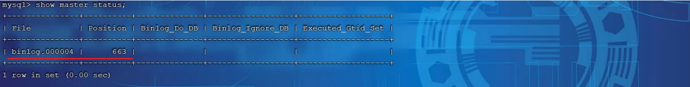
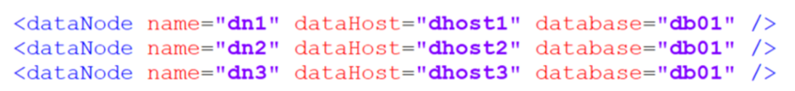
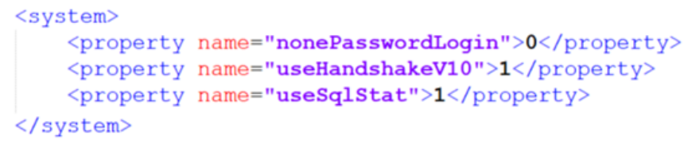
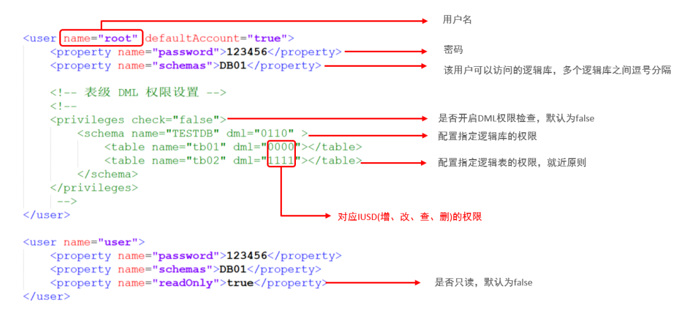
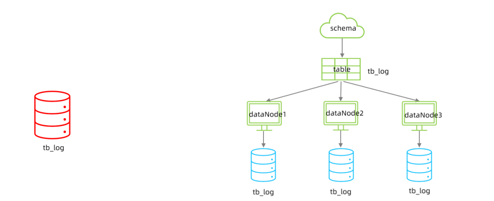
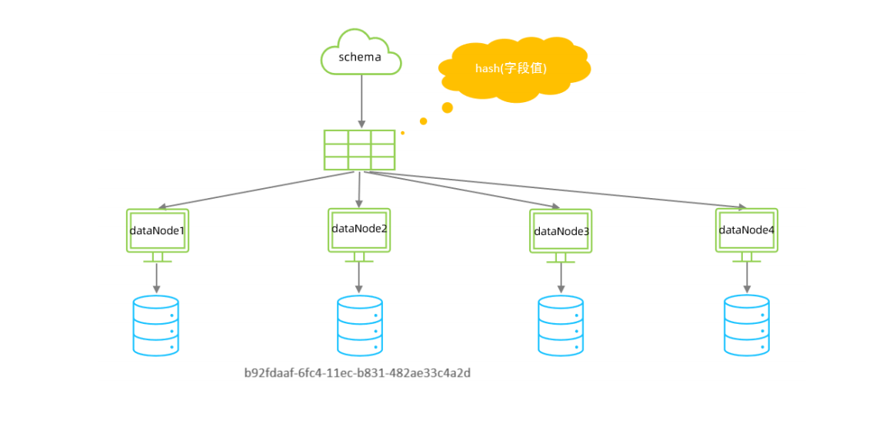

# 一、日志

### 1.错误日志

错误日志是记录了当mysqld启动和停止时，以及服务器在运行过程中发生任何严重错误时的相关信息，该日志**默认开启**的，默认存放目录**/var/log/**，默认的日志文件名为**mysqld.log**

查看错误日志参数

```mysql
show variables like '%log_error%';
```


### 2.二进制日志

##### 2.1 介绍

`概述`

二进制日志（BINLOG）**记录了所有DDL**（数据定义语言）语句和**DML**（数据操纵语言）语句，**不包括数据查询**（SELECT、SHOW）语句。用于灾难时的**数据恢复**和MySQL的**主从复制**。在MySQL8版本中，**默认二进制日志是开启状态**

查看二进制日志参数

```mysql
show variables like '%log_bin%'; #/var/lib/mysql/binlog
```


- log_bin_basename：当前数据库服务器的binlog日志的**基础名称(前缀)**，具体的binlog文件名需要**再加上编号(编号从000001开始)**

- log_bin_index：binlog的**索引文件**，里面记录了当前服务器关联的binlog文件有哪些

##### 2.2 格式

| 日志格式  | 含义                                                         |
| --------- | ------------------------------------------------------------ |
| STATEMENT | **基于SQL语句**的日志记录，记录的是SQL语句，对数据**进行修改的SQL**都会记录在日志文件中 |
| ROW       | **基于行**的日志记录，记录的是**每一行的数据变更（默认）**   |
| MIXED     | 混合了STATEMENT和ROW两种格式，**默认采用STATEMENT**，在某些特殊情况下会，自动切换为ROW进行记录 |

查看当前日志格式

```mysql
show variables like '%binlog_format%';
```

**注意事项**

如果需要配置二进制日志的格式，只需要在**/etc/my.cnf**中配置**binlog_forma**t参数

##### 2.3 查看

由于日志是以二进制方式存储的，不能直接读取，需要通过二进制日志查询工具 mysqlbinlog 来查看

查看二进制日志语法

```shell
mysqlbinlog [ 参数选项 ] logfilename

# 参数选项
    -d #指定数据库名称，只列出指定的数据库相关操作。
    -o #忽略掉日志中的前n行命令。
    -v #将行事件(数据变更)重构为SQL语句
    -vv #将行事件(数据变更)重构为SQL语句，并输出注释信息
```

##### 2.4 删除（看看就好，生产环境慎重）

对于比较繁忙的业务系统，每天生成的binlog数据巨大，如果长时间不清除，将会占用大量磁盘空间。可以通过以下几种方式清理日志

| 指令                                              | 含义                                                         |
| ------------------------------------------------- | ------------------------------------------------------------ |
| reset master                                      | 删除全部binlog日志，删除之后，日志编号，将从binlog.000001重新开始 |
| purge master logs to 'binlog.*'                   | 删除 * 编号之前的所有日志                                    |
| purge master logs before purge master logs before | 删除日志为 "yyyy-mm-dd hh24:mi:ss" 之前产生的所有日志        |

可以在mysql的配置文件中配置二进制日志的**过期时间**，设置了之后，二进制日志过期会自动删除，查看当前默认时间

```mysql
show variables like '%binlog_expire_logs_seconds%'; #默认30天
```

### 3.查询日志

查询日志中记录了客户端的**所有操作语句**，而二进制日志不包含查询数据的SQL语句。**默认情况下**查询日志**未开启**

如果需要开启查询日志，可以修改MySQL的配置文件**/etc/my.cnf**文件，添加如下内容

```shell
# 该选项用来开启查询日志 ， 可选值 ： 0 或者 1 ； 0 代表关闭， 1 代表开启
general_log=1
# 设置日志的文件名 ， 如果没有指定， 默认的文件名为 host_name.log
general_log_file=mysql_query.log

# 重启服务
systemctl restart mysqld
```

**重启mysql服务后** ，在**/var/lib/mysql/**目录下就会出现**mysql_query.log**文件。之后所有的客户端的增删改查操作都会记录在该日志文件之中，长时间运行后，该日志文件将会非常大

### 4.慢查询日志

慢查询日志记录了所有执行时间超过参数**long_query_time**设置值并且扫描记录数不小于**min_examined_row_limit**的所有的SQL语句的日志，**默认未开启**。long_query_time**默认为10秒，最小为0秒**，精度可以到微秒

如果需要开启慢查询日志，需要在MySQL的配置文件/etc/my.cnf中配置如下参数

```shell
# 慢查询日志
slow_query_log=1
# 执行时间参数
long_query_time=2

# 重启服务
systemctl restart mysqld
```

**重启mysql服务后** ，在**/var/lib/mysql/**目录下就会出现**localhost-slow.log**文件

**默认情况下不会记录管理语句**，也不会记录不使用索引进行查找的查询。可以配置l**og_slow_admin_statements**和更改此行为 **log_queries_not_using_indexes**参数，如下所述

```shell
# 记录执行较慢的管理语句
log_slow_admin_statements =1
# 记录执行较慢的未使用索引的语句
log_queries_not_using_indexes = 1

# 重启服务
systemctl restart mysqld
```

上述所有的参数配置完成之后，都需要重**启mysql服务**才可以生效

# 二、主从复制

### 1.概述

主从复制是将**主数据库**的**DDL**和**DML**操作通过二进制日志传到从库服务器中，然后在**从库上**对这些日志**重新执行**（重做），从而使得从库和主库的数据保持同步。MySQL支持一台主库同时向多台从库进行复制， 从库也可以作为其他从服务器的主库，实现链状复制


MySQL复制的优点主要包含以下三个方面：

- 主库出现问题，可以快速切换到从库提供服务

- 实现读写分离，降低主库的访问压力

- 可以在从库中执行备份，以避免备份期间影响主库服务

### 2.原理


复制分成三步：

- Master主库在事务提交时，会把数据变更记录在二进制日志文件Binlog中
- 从库读取主库的二进制日志文件Binlog，写入到从库的中继日志Relay Log中
- slave重做中继日志中的事件，将改变反映它自己的数据

### 3.搭建

##### 3.1 准备


##### 3.2 主库配置

`修改配置文件/etc/my.cnf`

```shell
#mysql的服务ID，保证整个集群环境中唯一，取值范围：1 -- 232-1，默认为1
server-id=1
#是否只读，1代表只读，0代表读写
read-only=0

#忽略的数据，指不需要同步的数据库
#binlog-ignore-db=mysql
#指定同步的数据库
#binlog-do-db=db01
```

`重启MySQL服务器`

```shell
systemctl restart mysqld
```

`登录mysql，创建远程连接的账号，并授予主从复制权限`

```mysql
#创建itcast用户，并设置密码，该用户可在任意主机连接该MySQL服务
CREATE USER 'itcast'@'%' IDENTIFIED WITH mysql_native_password BY 'Root@123456';

#为'itcast'@'%'用户分配主从复制权限
GRANT REPLICATION SLAVE ON *.* TO 'itcast'@'%';
```

`查看二进制日志坐标`

```mysql
show master status;
```



字段含义说明：

- file：从哪个日志文件开始推送日志文件
- position：从哪个位置开始推送日志
- binlog_ignore_db：指定不需要同步的数据库

##### 3.3 从库配置

`修改配置文件/etc/my.cnf`

```shell
#mysql 服务ID，保证整个集群环境中唯一，取值范围：1 -- 2^32-1，和主库不一样即可
server-id=2
#是否只读,1 代表只读, 0 代表读写
read-only=1
```

`重启MySQL服务器`

```shell
systemctl restart mysqld
```

`登录mysql，设置主库配置`

```mysql
#mtsql8.0.23中的语法
CHANGE REPLICATION SOURCE TO SOURCE_HOST='192.168.200.200', SOURCE_USER='itcast',
SOURCE_PASSWORD='Root@123456', SOURCE_LOG_FILE='binlog.000004',
SOURCE_LOG_POS=663;

#mysql8.0.23之前的语法
CHANGE MASTER TO MASTER_HOST='192.168.200.200', MASTER_USER='itcast',
MASTER_PASSWORD='Root@123456', MASTER_LOG_FILE='binlog.000004',
MASTER_LOG_POS=663;
```

| 参数名          | 含义               | 8.0.23之前      |
| --------------- | ------------------ | --------------- |
| SOURCE_HOST     | 主库IP地址         | MASTER_HOST     |
| SOURCE_USER     | 连接主库的用户名   | MASTER_USER     |
| SOURCE_PASSWORD | 连接主库的密码     | MASTER_PASSWORD |
| SOURCE_LOG_FILE | binlog日志文件名   | MASTER_LOG_FILE |
| SOURCE_LOG_POS  | binlog日志文件位置 | MASTER_LOG_POS  |

`开启同步操作`

```mysql
start replica ; #8.0.22之后
start slave ; #8.0.22之前
```

`查看主从同步状态`

```mysql
show replica status ; #8.0.22之后
show slave status ; #8.0.22之前
```


##### 3.4 测试

`在主库创建数据库、表、插入数据`

```mysql
create database db01;

use db01;

create table tb_user(
id int(11) primary key not null auto_increment,
name varchar(50) not null,
sex varchar(1)
)engine=innodb default charset=utf8mb4;

insert into tb_user(id,name,sex) values(null,'Tom', '1'),(null,'Trigger','0'),(null,'Dawn','1');
```

`在从库中查询数据，验证主从是否同步`


# 三、分库分表

### 1.介绍

##### 1.1 问题分析

`分库分表原因`

随着互联网及移动互联网的发展，应用系统的数据量也是成指数式增长，若采用单数据库进行数据存储，存在以下性能瓶颈

- IO瓶颈
  - 磁盘IO：热点数据太多，数据库缓存不足，产生大量磁盘IO，效率较低
  - 网络IO：请求数据太多，带宽不够，网络IO瓶颈
- CPU瓶颈：排序、分组、连接查询、聚合统计等SQL会耗费大量的CPU资源，请求数太多

`分库分表处理`

分库分表的中心思想都是将**数据分散存储**，使得单一数据库/表的数据量变小来缓解单一数据库的性能问题，从而提升数据库性能


##### 1.2 拆分策略

分库分表的**形式**主要是两种：**垂直拆分**和**水平拆分**。而拆分的**粒度**，一般又分为**分库**和**分表**，所以组成的拆分策略最终如下


##### 1.3 垂直拆分

`垂直分库`

垂直分库：以表为依据，根据业务将不同表拆分到不同库中

特点：

- 每个库的表结构都不一样

- 每个库的数据也不一样

- 所有库的并集是全量数据


`垂直分表`

垂直分表：以字段为依据，根据字段属性将不同字段拆分到不同表中

特点：

- 每个表的结构都不一样
- 每个表的数据也不一样，一般通过一列（主键/外键）关联
- 所有表的并集是全量数据


##### 1.4 水平拆分

`水平分库`

水平分库：以字段为依据，按照一定策略，将一个库的数据拆分到多个库中

特点：

- 每个库的表结构都一样
- 每个库的数据都不一样
- 所有库的并集是全量数据


`水平分表`

水平分表：以字段为依据，按照一定策略，将一个表的数据拆分到多个表中

特点：

- 每个表的表结构都一样
- 每个表的数据都不一样
- 所有表的并集是全量数据


##### 1.5 实现技术

`shardingJDBC`

基于AOP原理，在应用程序中对本地执行的SQL进行拦截，解析、改写、路由处理。需要自行编码配置实现，只支持java语言

`MyCat`

数据库分库分表中间件，不用调整代码即可实现分库分表，支持多种语言，性能不及前者

### 2.MyCat概述

##### 2.1 介绍

Mycat是开源的、活跃的、基于**Java**语言编写的**MySQL数据库中间件**。可以像使用mysql一样来使用mycat，对于开发人员来说根本感觉不到mycat的存在。开发人员只需要连接MyCat即可，而具体底层用到几台数据库，每一台数据库服务器里面存储了什么数据，都无需关心。 **具体的分库分表的策略，只需要在MyCat中配置即可**


##### 2.2 下载(推荐1.6版本)

下载地址：http://dl.mycat.org.cn/

##### 2.3 安装

Mycat是采用java语言开发的开源的数据库中间件，支持Windows和Linux运行环境，下面介绍MyCat的Linux中的环境搭建。我们需要在准备好的服务器中安装如下软件

- MySQL

- JDK
- Mycat

| 服务器          | 安装软件   | 说明              |
| --------------- | ---------- | ----------------- |
| 192.168.200.210 | JDK、Mycat | MyCat中间件服务器 |
| 192.168.200.210 | MySQL      | 分片服务器        |
| 192.168.200.213 | MySQL      | 分片服务器        |
| 192.168.200.214 | MySQL      | 分片服务器        |

具体的安装步骤：参考资料中提供的[MyCat安装文档](./information/MyCat安装文档/MyCat安装文档.md)即可，里面有详细的安装及配置步骤

##### 2.4 目录介绍

`bin`

存放可执行文件，用于启动停止mycat

`conf`

存放mycat的配置文件

`lib`

存放mycat的项目依赖包（jar）

`logs`

存放mycat的日志文件

##### 2.5 概念介绍

在MyCat的整体结构中，分为两个部分：上面的**逻辑结构**、下面的**物理结构**。在MyCat的**逻辑结构主要负责**逻辑库、逻辑表、分片规则、分片节点等**逻辑结构的处理**，而**具体的数据存储还是在物理结构**，也就是数据库服务器中存储的


### 3.MyCat入门

##### 3.1 需求

由于tb_order表中数据量很大，磁盘IO及容量都到达了瓶颈，现在需要对tb_order表进行数据分片，分为三个数据节点，每一个节点主机位于不同的服务器上, 具体的结构，参考下图


##### 3.2 环境准备

`准备3台服务器并创建数据库db01`

- 192.168.200.210：MyCat中间件服务器，同时也是第一个分片服务器
- 192.168.200.213：第二个分片服务器
- 192.168.200.214：第三个分片服务器


##### 3.3 配置

`schema.xml`

在schema.xml中配置**逻辑库、逻辑表、数据节点、节点主机**等相关信息

```xml
<?xml version="1.0"?>
<!DOCTYPE mycat:schema SYSTEM "schema.dtd">
<mycat:schema xmlns:mycat="http://io.mycat/">
    <schema name="DB01" checkSQLschema="true" sqlMaxLimit="100">
        <table name="TB_ORDER" dataNode="dn1,dn2,dn3" rule="auto-sharding-long"/>
    </schema>
    
    <dataNode name="dn1" dataHost="dhost1" database="db01" />
    <dataNode name="dn2" dataHost="dhost2" database="db01" />
    <dataNode name="dn3" dataHost="dhost3" database="db01" />
    
    <dataHost name="dhost1" maxCon="1000" minCon="10" balance="0"
        writeType="0" dbType="mysql" dbDriver="jdbc" switchType="1" slaveThreshold="100">
        
    <heartbeat>select user()</heartbeat>
    
        <writeHost host="master" url="jdbc:mysql://192.168.200.210:3306?
        useSSL=false&amp;serverTimezone=Asia/Shanghai&amp;characterEncoding=utf8"
        user="root" password="1234" />
    </dataHost>
    
    <dataHost name="dhost2" maxCon="1000" minCon="10" balance="0"
    	writeType="0" dbType="mysql" dbDriver="jdbc" switchType="1" slaveThreshold="100">
    
    	<heartbeat>select user()</heartbeat>
    	<writeHost host="master" url="jdbc:mysql://192.168.200.213:3306?
    		useSSL=false&amp;serverTimezone=Asia/Shanghai&amp;characterEncoding=utf8"
    		user="root" password="1234" />
    </dataHost>
    
    <dataHost name="dhost3" maxCon="1000" minCon="10" balance="0"
    	writeType="0" dbType="mysql" dbDriver="jdbc" switchType="1" slaveThreshold="100">
    
    <heartbeat>select user()</heartbeat>
    
        <writeHost host="master" url="jdbc:mysql://192.168.200.214:3306?
    		useSSL=false&amp;serverTimezone=Asia/Shanghai&amp;characterEncoding=utf8"
    		user="root" password="1234" />
    </dataHost>
</mycat:schema>
```

`server.xml`

在server.xml中配置**用户名、密码、用户访问权限**信息

```xml
<user name="root" defaultAccount="true">
    <property name="password">123456</property>
    <property name="schemas">DB01</property>
    
    <!-- 表级 DML 权限设置 -->
    <!--
        <privileges check="true">
            <schema name="DB01" dml="0110" >
            	<table name="TB_ORDER" dml="1110"></table>
            </schema>
    	</privileges>
    -->
</user>

<user name="user">
    <property name="password">123456</property>
    <property name="schemas">DB01</property>
    <property name="readOnly">true</property>
</user>
```

**注意事项**

**root**用户访问DB01逻辑库**可以读、写**，但是**user**用户访问DB01逻辑库**只能读**

##### 3.4 运行

`启动`

配置完毕后，先启动涉及到的3台分片服务器，然后切换到Mycat的安装目录启动MyCat服务器并执行如下指令

```shell
#启动
bin/mycat start
#停止
bin/mycat stop
```

Mycat启动之后，占用端口号**8066**

`测试`

连接并登陆MyCat

```shell
mysql -h 192.168.200.210 -P 8066 -uroot -p123456
```

`数据测试`

```mysql
CREATE TABLE TB_ORDER (
	id BIGINT(20) NOT NULL,
    title VARCHAR(100) NOT NULL ,
	PRIMARY KEY (id)
) ENGINE=INNODB DEFAULT CHARSET=utf8;

INSERT INTO TB_ORDER(id,title) VALUES(1,'goods1');
INSERT INTO TB_ORDER(id,title) VALUES(2,'goods2');
INSERT INTO TB_ORDER(id,title) VALUES(3,'goods3');
INSERT INTO TB_ORDER(id,title) VALUES(1,'goods1');
INSERT INTO TB_ORDER(id,title) VALUES(2,'goods2');
INSERT INTO TB_ORDER(id,title) VALUES(3,'goods3');
INSERT INTO TB_ORDER(id,title) VALUES(5000000,'goods5000000');
INSERT INTO TB_ORDER(id,title) VALUES(10000000,'goods10000000');
INSERT INTO TB_ORDER(id,title) VALUES(10000001,'goods10000001');
INSERT INTO TB_ORDER(id,title) VALUES(15000000,'goods15000000');
INSERT INTO TB_ORDER(id,title) VALUES(15000001,'goods15000001');
```

经过测试，在往TB_ORDER表中插入数据时

- 如果id的值在**1-500w**之间，数据将会存储在**第一个分片**数据库中
- 如果id的值在**500w-1000w**之间，数据将会存储在**第二个分片**数据库中
- 如果id的值在**1000w-1500w**之间，数据将会存储在**第三个分片**数据库中
- 如果id的值**超出1500w**，在插入数据时将会**报错**

### 4.MyCat配置

##### 4.1 schema.xml

schema.xml作为MyCat中最重要的配置文件之一 , 涵盖了MyCat的逻辑库 、 逻辑表 、 分片规则、分片节点及数据源的配置，主要包含以下三组标签：

- schema标签
- datanode标签
- datahost标签

`schema标签`


1).schema 定义逻辑库

**schema标签**用于定义MyCat实例中的**逻辑库** , 一个MyCat实例中, 可以**有多个逻辑库** , 可以通过schema标签来划分不同的逻辑库。MyCat中的逻辑库的概念，等同于MySQL中的database概念, 需要操作某个逻辑库下的表时, 也需要切换逻辑库(use xxx)

核心属性

- name：指定自定义的逻辑库库名
- checkSQLschema：在SQL语句操作时指定了数据库名称，执行时是否自动去除；true：自动去除，false：不自动去除

- sqlMaxLimit：如果未指定limit进行查询，列表查询模式查询多少条记录

2).schema 中的table定义逻辑表

**table标签**定义了MyCat中逻辑库schema下的**逻辑表** , 所有需要拆分的表都需要在table标签中定义

核心属性

- name：定义逻辑表表名，在该逻辑库下唯一
- dataNode：定义逻辑表所属的dataNode，该属性需要与dataNode标签中name对应；多个dataNode逗号分隔
- rule：分片规则的名字，分片规则名字是在rule.xml中定义的
- primaryKey：逻辑表对应真实表的主键
- type：逻辑表的类型，目前逻辑表只有全局表和普通表，如果未配置，就是普通表；全局表，配置为 global

`datanode标签`



核心属性

- name：定义数据节点名称
- dataHost：数据库实例主机名称，引用自 dataHost 标签中name属性
- database：定义分片所属数据库

`datahost标签`


该标签在MyCat逻辑库中作为底层标签存在, 直接定义了具体的**数据库实例、读写分离、心跳语句**

核心属性

- name：唯一标识，供上层标签使用
- maxCon/minCon：最大连接数/最小连接数
- balance：负载均衡策略，取值 0,1,2,3
- writeType：写操作分发方式（0：写操作转发到第一个writeHost，第一个挂了，切换到第二个；1：写操作随机分发到配置的writeHost）
- dbDriver：数据库驱动，支持 native、jdbc

##### 4.2 rule.xml

rule.xml中定义所有**拆分表的规则**, 在使用过程中可以灵活的使用分片算法, 或者对同一个分片算法使用不同的参数, 它让分片过程可配置化。主要包含两类标签：**tableRule、Function**


##### 4.3 server.xml

server.xml配置文件包含了MyCat的系统配置信息，主要有两个重要的标签：system、user

`system标签`

主要配置MyCat中的系统配置信息，对应的系统配置项及其含义，如下



| 属性                      | 取值       | 含义                                                         |
| ------------------------- | ---------- | ------------------------------------------------------------ |
| charset                   | utf8       | 设置Mycat的字符集, 字符集需要与MySQL的字符集保持一致         |
| nonePasswordLogin         | 0,1        | 0为需要密码登陆、1为不需要密码登陆 ,默认为0，设置为1则需要指定默认账户 |
| useHandshakeV10           | 0,1        | 使用该选项主要的目的是为了能够兼容高版本的jdbc驱动, 是否采用HandshakeV10Packet来与client进行通信, 1:是, 0:否 |
| useSqlStat                | 0,1        | 开启SQL实时统计, 1 为开启 , 0 为关闭 ;开启之后, MyCat会自动统计SQL语句的执行情况 ; mysql -h 127.0.0.1 -P 9066-u root -p 查看MyCat执行的SQL, 执行效率比较低的SQL , SQL的整体执行情况、读写比例等 ; show @@sql ; show@@sql.slow ; show @@sql.sum ; |
| useGlobleTableCheck       | 0,1        | 是否开启全局表的一致性检测。1为开启 ，0为关闭                |
| sqlExecuteTimeout         | 1000       | SQL语句执行的超时时间 , 单位为s                              |
| sequnceHandlerType        | 0,1,2      | 用来指定Mycat全局序列类型，0 为本地文件，1为数据库方式，2为时间戳列方式，默认使用本地文件方式，文件方式主要用于测试 |
| sequnceHandlerPattern     | 正则表达式 | 必须有MYCATSEQ或mycatseq进入序列匹配流程，注意MYCATSEQ_有空格的情况 |
| subqueryRelationshipCheck | true,false | 子查询中存在关联查询的情况下,检查关联字段中是否有分片字段 .默认false |
| subqueryRelationshipCheck | 0,1        | 开启mysql压缩协议 , 0 : 关闭, 1 : 开启                       |
| fakeMySQLVersion          | 5.5,5.6    | 设置模拟的MySQL版本号                                        |

`user标签`

配置MyCat中的用户、访问密码，以及用户针对于逻辑库、逻辑表的权限信息



在测试权限操作时，我们只需要将privileges标签的注释放开。privileges的schema标签中配置的dml属性配置的是逻辑库的权限。在privileges的schema下的table标签的dml属性中配置逻辑表的权限

### 5.MyCat分片

##### 5.1 垂直拆分

`场景`

在业务系统中, 涉及以下表结构 ,但是由于用户与订单每天都会产生大量的数据, 单台服务器的数据存储及处理能力是有限的, 可以对数据库表进行拆分, 原有的数据库表如下


`策略`

现在考虑将其进行垂直分库操作，将商品相关的表拆分到一个数据库服务器，订单表拆分的一个数据库服务器，用户及省市区表拆分到一个服务器。并在192.168.200.210，192.168.200.213, 192.168.200.214上面创建数据库**shopping**


##### 5.2 水平拆分

`场景`

在业务系统中, 有一张表(日志表), 业务系统每天都会产生大量的日志数据 , 单台服务器的数据存储及处理能力是有限的, 可以对数据库表进行拆分



`策略`

在三台数据库服务器中分表创建一个数据库**itcast**


##### 5.3 分片规则

###### 5.3.1 范围分片

根据指定的字段及其配置的范围与数据节点的对应情况，来决定该数据属于哪一个分片


###### 5.3.2 取模分片

根据指定的字段值与节点数量进行求模运算，根据运算结果，来决定该数据属于哪一个分片


###### 5.3.3  一致性hash分片

所谓一致性哈希，相同的哈希因子计算值总是被划分到相同的分区表中，不会因为分区节点的增加而改变原来数据的分区位置，有效的解决了分布式数据的拓容问题



###### 5.3.4 枚举分片

通过在配置文件中配置可能的枚举值, 指定数据分布到不同数据节点上, 本规则适用于按照省份、性别、状态拆分数据等业务


###### 5.3.5 应用指定算法

运行阶段由应用自主决定路由到那个分片，直接根据字符子串（必须是数字）计算分片号


###### 5.3.6  固定分片hash算法

该算法类似于十进制的求模运算，但是为二进制的操作，例如取id的二进制低10位与1111111111进行位&运算，位与运算最小值为 0000000000，最大值为1111111111，转换为十进制，也就是位于**0-1023**之间


###### 5.3.7  固定分片hash算法

截取字符串中的指定位置的子字符串, 进行hash算法，算出分片


###### 5.3.8 按天分片算法

按照日期及对应的时间周期来分片


###### 5.3.9 自然月分片

使用场景为按照月份来分片, 每个自然月为一个分片


### 6.MyCat管理及监控

##### 6.1 MyCat原理

在MyCat中，当执行一条SQL语句时，MyCat需要进行**SQL解析、分片分析、路由分析、读写分离分析**等操作，最终经过一系列的分析决定将当前的SQL语句到底路由到那几个(或哪一个)节点数据库，数据库将数据执行完毕后，如果有返回的结果，则将结果返回给MyCat，最终还需要在MyCat中进行**结果合并、聚合处理、排序处理、分页处理**等操作，最终再将结果返回给客户端。而在MyCat的使用过程中，MyCat官方也提供了一个**管理监控平台MyCat-Web（MyCat-eye）**

Mycat-web是Mycat**可视化运维的管理和监控平台**，弥补了Mycat在监控上的空白。帮Mycat分担统计任务和配置管理任务。Mycat-web 引入了**ZooKeeper作为配置中心**，可以管理多个节点。Mycat-web主要**管理和监控Mycat的流量、连接、活动线程和内存等**，具备IP白名单、邮件告警等模块，还可以统计SQL并分析慢SQL和高频SQL等。为优化SQL提供依据


##### 6.2 MyCat管理

Mycat默认开通2个端口，可以在server.xml中进行修改

- 8066 数据访问端口，即进行 DML 和 DDL 操作
- 9066 数据库管理端口，即 mycat 服务管理控制功能，用于管理mycat的整个集群状态

连接MyCat的管理控制台

```shell
mysql -h 192.168.200.210 -p 9066 -uroot -p123456 1
```

| 命令              | 含义                        |
| ----------------- | --------------------------- |
| show @@help       | 查看Mycat管理工具帮助文档   |
| show @@version    | 查看Mycat的版本             |
| reload @@config   | 重新加载Mycat的配置文件     |
| show @@datasource | 查看Mycat的数据源信息       |
| show @@datanode   | 查看MyCat现有的分片节点信息 |
| show @@threadpool | 查看Mycat的线程池信息       |
| show @@sql        | 查看执行的SQL               |
| show @@sql.sum    | 查看执行的SQL统计           |

##### 6.3 MyCat-eye

###### 6.3.1 介绍

Mycat-web(Mycat-eye)是对mycat-server提供监控服务，他通过JDBC连接对Mycat、Mysql监控，监控远程服务器(目前仅限于linux系统)的cpu、内存、网络、磁盘。Mycat-eye运行过程中需要依赖zookeeper，因此需要先安装zookeeper

###### 6.3.2 安装

具体的安装步骤：参考资料中提供的[MyCat-Web安装文档](./information/MyCat-Web安装文档/MyCat-Web安装文档.md)即可，里面有详细的安装及配置步骤

###### 6.3.3 访问

http://192.168.200.210:8082/mycat

###### 6.3.4 配置

`开启MyCat的实时统计功能(server.xml)`

```shell
<property name="useSqlStat">1</property> #1为开启实时统计、0为关闭
```

`在Mycat监控界面配置服务地址`


###### 6.3.5 测试

`性能监控`


`物理节点`


`SQL统计`


`SQL表分析`


`SQL监控`


`高频SQL`


# 四、读写分离

### 1.介绍

读写分离,简单地说是把对数据库的**读和写操作分开**,以对应不同的数据库服务器。**主数据库**提供**写操作**，**从数据库**提供**读操作**，这样能有效地减轻单台数据库的压力

通过MyCat即可轻易实现上述功能，不仅可以支持MySQL，也可以支持Oracle和SQL Server


### 2.一主一从

MySQL的主从复制，是基于二进制日志（binlog）实现的


### 3.一主一从读写分离

MyCat控制后台数据库的**读写分离和负载均衡**由**schema.xml文件datahost标签**的**balance属性**控制

##### 3.1 schema.xml配置

```xml
<!-- 配置逻辑库 -->
<schema name="ITCAST_RW" checkSQLschema="true" sqlMaxLimit="100" dataNode="dn7">
</schema>

<dataNode name="dn7" dataHost="dhost7" database="itcast" />

<dataHost name="dhost7" maxCon="1000" minCon="10" balance="1" writeType="0"
dbType="mysql" dbDriver="jdbc" switchType="1" slaveThreshold="100">
	<heartbeat>select user()</heartbeat>
	<writeHost host="master1" url="jdbc:mysql://192.168.200.211:3306?
	useSSL=false&amp;serverTimezone=Asia/Shanghai&amp;characterEncoding=utf8"
	user="root" password="1234" >
	
    <readHost host="slave1" url="jdbc:mysql://192.168.200.212:3306?
	useSSL=false&amp;serverTimezone=Asia/Shanghai&amp;characterEncoding=utf8"
	user="root" password="1234" />
</writeHost>
</dataHost>
```

上述配置的具体关联对应情况如下


writeHost是写操作对应的数据库，readHost是读操作对应的数据库。要想实现读写分离，就得配置**writeHost关联**的是**主库**，**readHost关联**的是**从库**。还需要配置**负责均衡的参数balance**，取值有4种，具体含义如下

| 参数值 | 含义                                                         |
| ------ | ------------------------------------------------------------ |
| 0      | 不开启读写分离机制 , 所有读操作都发送到当前可用的writeHost上 |
| 1      | 全部的readHost 与 备用的writeHost 都参与select 语句的负载均衡（主要针对于双主双从模式） |
| 2      | 所有的读写操作都随机在writeHost , readHost上分发             |
| 3      | 所有的读请求随机分发到writeHost对应的readHost上执行, writeHost不负担读压力 |

**注意事项**

在**一主一从模式**的读写分离中，balance配置**1**或**3**都是可以完成读写分离的

##### 3.2 server.xml配置

配置root用户可以访问SHOPPING、ITCAST 以及 ITCAST_RW逻辑库

```xml
<user name="root" defaultAccount="true">
    <property name="password">123456</property>
    <property name="schemas">SHOPPING,ITCAST,ITCAST_RW</property>
    <!-- 表级 DML 权限设置 -->
    <!--
    <privileges check="true">
        <schema name="DB01" dml="0110" >
        	<table name="TB_ORDER" dml="1110"></table>
        </schema>
    </privileges>
    -->
</user>
```

##### 3.3 测试

配置完毕MyCat后，重新启动MyCat

```shell
bin/mycat stop
bin/mycat start
```

在测试中，我们可以发现当主节点Master宕机之后，业务系统就只能够读，而不能写入数据了，得通过双主双从来解决


### 4.双主双从

一个主机Master1用于处理所有写请求，它的从机Slave1和另一台主机Master2还有它的从机Slave2负责所有读请求。当Master1主机宕机后，Master2主机负责写请求，Master1 、Master2互为备机


### 5.双主双从读写分离

https://www.bilibili.com/video/BV1Kr4y1i7ru?p=193&vd_source=1af4a315446a6c7a9915bdd28c552814

