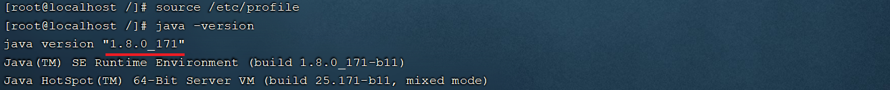

# 一、JDK安装

### 1.上传安装包

将jdk的二进制发布包上传到Linux选择的根目录 /，上传完毕后切换到根目录下，查看上传的安装包


### 2.解压安装包

执行如下指令，将上传上来的压缩包进行解压，并通过-C参数指定解压文件存放目录为/usr/local

```shell
tar -zxvf jdk-8u171-linux-x64.tar.gz -C /usr/local
```


### 3.配置环境变量

使用vim命令修改/etc/profile文件，在文件末尾加入如下配置

```shell
JAVA_HOME=/usr/local/jdk1.8.0_171
PATH=$JAVA_HOME/bin:$PATH
```

### 4.重新加载profile文件

为了使更改的配置立即生效，需要重新加载profile文件，执行命令

```shell
source /etc/profile
```

### 5.检查安装是否成功

```shell
java -version
```



# 二、MyCat安装

### 1.上传Mycat压缩包到服务器

包名为：Mycat-server-1.6.7.3-release-20210913163959-linux.tar.gz

### 2.解压MyCat的压缩包

```shell
tar -zxvf Mycat-server-1.6.7.3-release-20210913163959-linux.tar.gz -C /usr/local/
```

### 3.替换老旧jar包并给予权限

```shell
# 切换目录
cd /usr/local/mycat/lib

# 删除老旧连接jar包
rm -rf mysql-connector-java-5.1.35.jar

# 上传一个最新版本的连接jar包并修改权限
chmod 777 mysql-connector-java-8.0.22.jar
```
