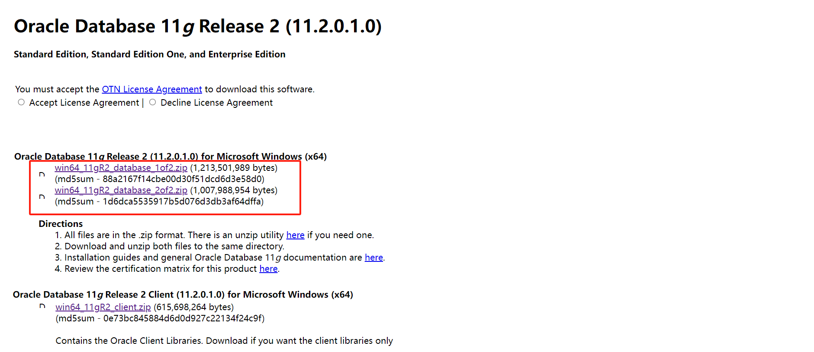
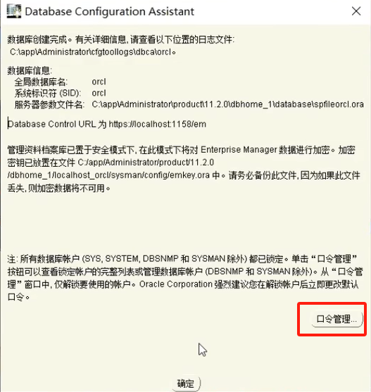
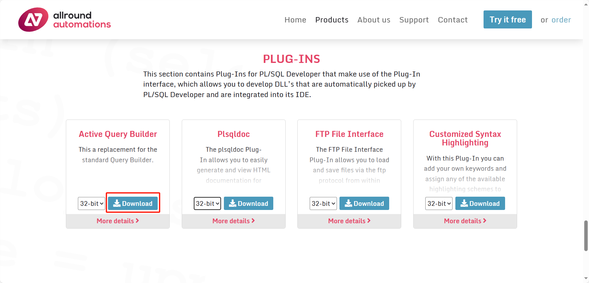
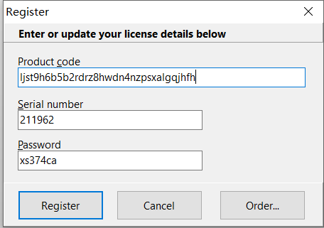
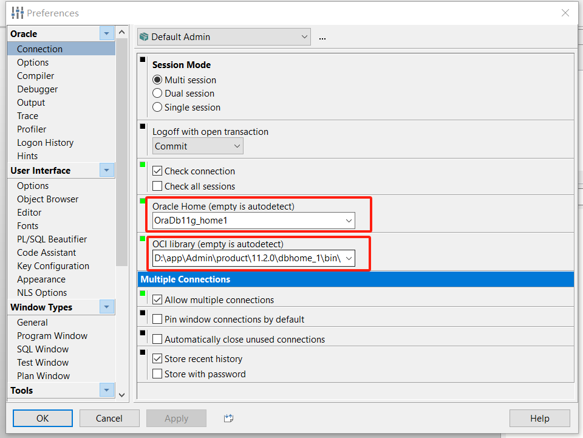
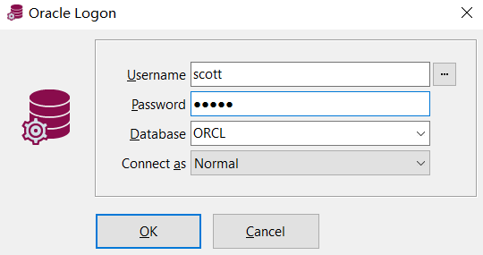

# 一、Windows安装Oracle

### 1.下载Oracle11g安装包

官网：[Oracle Database 11g Release 2 for Microsoft Windows (x64)](https://www.oracle.com/partners/campaign/112010-win64soft-094461.html)



**注意事项**

下载的2个压缩包解压后需要**合并到一个文件夹**

### 2.安装Oracle

##### 2.1 运行安装文件


##### 2.2 安装时配置scott用户



##### 2.3 安装后配置scott用户

```sql
# 打开cmd命令窗口，输入sqlplus命令使用system用户登陆
sqlplus

# 解锁scott用户
alter user scott account unlock;

# 为scott用户设置密码为tiger
alter user scott identified by tiger;

# 切换scott用户登陆
conn scott/tiger
```

# 二、Windows卸载Oracle

https://www.bilibili.com/video/BV12Y4y1W7uc?p=6&vd_source=1af4a315446a6c7a9915bdd28c552814

# 三、Windows安装PLSQL

### 1.下载PLSQL安装包

官网：[PL/SQL Developer - Allround Automations](https://www.allroundautomations.com/products/pl-sql-developer/)



### 2.安装PLSQL

无脑下一步就行

### 3.PLSQL连接配置

##### 3.1 注册

[plsql14注册码](‪./information/PLSQL/plsql14注册码.txt)



##### 3.2 配置主目录和OCI库



##### 3.3 重启连接



# 四、Windows卸载PLSQL

https://www.bilibili.com/video/BV12Y4y1W7uc?p=5&vd_source=1af4a315446a6c7a9915bdd28c552814