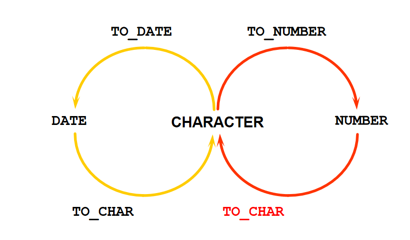

# 一、基本SQL-SELECT语句

### 1.空值运算

##### 1.1 概述

空值不是0，且查询时不参与运算

### 2.连接符

##### 2.1 概述

把**列与列**或**列与字符**连接在一起

##### 2.2 示例

```sql
SELECT last_name||job_id AS "Employees" FROM employees;
```

**注意事项**

日期和字符只能在单引号中出现

### 3.测试问题与答案

- 对于日期型数据, 做 *, / 运算不合法

- 包含空值的数学表达式的值都为空值

- 别名使用双引号!

- oracle 中连接字符串使用 "||", 而不是 java 中的 "+"

- 日期和字符只能在单引号中出现
- distinct 关键字, 以下语法错误`select last_name, distinct department_id from employees`

# 二、过滤和排序顺序

### 1.转义符(ESCAPE)

##### 1.1 概述

回避特殊符号的：使用转义符。例如：`将[%]转为[\%]、[_]转为[\_]`，然后再加上[ESCAPE ‘\’] 即可

##### 1.2 示例

```sql
SELECT job_id FROM jobs WHERE job_id LIKE 'IT\_%' ESCAPE '\';
```

### 2.测试问题与答案

- 在单引号中的值是否区分大小写？区分大小写
- 日期必须要放在单引号中, 且必须是指定的格式

# 三、单行函数

### 1字符函数

##### 1.1 大小写函数

| 函数                  | 结果       |
| --------------------- | ---------- |
| LOWER('SQL Course')   | sql course |
| UPPER('SQL Course')   | SQL COURSE |
| INITCAP('SQL Course') | Sql Course |

##### 1.2 字符控制函数

| 函数                        | 结果         |
| --------------------------- | ------------ |
| CONCAT('Hello', 'World')    | HelloWorld   |
| SUBSTR('HelloWorld',1,5)    | Hello        |
| LENGTH('HelloWorld')        | 10           |
| INSTR('HelloWorld', 'W')    | 6            |
| LPAD(salary,10,'*')         | `*****24000` |
| RPAD(salary, 10, '*')       | `24000*****` |
| TRIM('H' FROM 'HelloWorld') | elloWorld    |
| REPLACE(‘abcd’,’b’,’m’)     | amcd         |

### 2.数字函数

##### 2.1 ROUND(四舍五入)

ROUND(45.926, 2)

45.93

##### 2.2 TRUNC(截断)

TRUNC(45.926, 2)

45.92

##### 2.3 MOD(求余)

MOD(1600, 300)

100

### 3.日期函数

| 函数           | 描述                              |
| -------------- | --------------------------------- |
| MONTHS_BETWEEN | 两个日期相差的月数                |
| ADD_MONTHS     | 向指定日期中加上若干月数          |
| NEXT_DAY       | 指定日期的下一个星期 * 对应的日期 |
| LAST_DAY       | 本月的最后一天                    |
| ROUND          | 日期四舍五入                      |
| TRUNC          | 日期截断                          |

### 4.转换函数

##### 4.1 隐性转换

| 源数据类型       | 目标数据类型 |
| ---------------- | ------------ |
| VARCHAR2 or CHAR | NUMBER       |
| VARCHAR2 or CHAR | DATE         |
| NUMBER           | VARCHAR2     |
| DATE             | VARCHAR2     |

##### 4.2 显性转换



| 日期格式的元素 | 示例                  |
| -------------- | --------------------- |
| YYYY           | 2004                  |
| YEAR           | TWO THOUSAND AND FOUR |
| MM             | 02                    |
| MONTH          | JULY                  |
| MON            | JUL                   |
| DY             | MON                   |
| DAY            | MONDAY                |
| DD             | 02                    |

### 5.通用函数

##### 5.1 NVL

`概述`

将空值转换成一个已知的值，可以使用的数据类型有日期、字符、数字

`示例`

- NVL(commission_pct,0)
- NVL(hire_date,'01-JAN-97')
- NVL(job_id,'No Job Yet')

##### 5.2 NVL2

NVL2 (expr1, expr2, expr3) : expr1不为NULL，返回expr2；为NULL，返回expr3

##### 5.3 NULLIF

NULLIF (expr1, expr2) :  相等返回NULL，不等返回expr1

##### 5.4 COALESCE

`概述`

如果第一个表达式为空,则返回下一个表达式，对其他的参数进行COALESCE

`示例`

```sql
SELECT last_name,
COALESCE(commission_pct, salary, 10) comm
FROM employees
ORDER BY commission_pct;
```

##### 5.5 DECODE

`语法`

```sql
DECODE(col|expression, search1, result1 ,
      			   [, search2, result2,...,]
      			   [, default])
```

`函数`

```sql
SELECT last_name, salary,
       DECODE (TRUNC(salary/2000, 0),
               0, 0.00,
               1, 0.09,
               2, 0.20,
               3, 0.30,
               4, 0.40,
               5, 0.42,
               6, 0.44,
               0.45) TAX_RATE
FROM employees
WHERE department_id = 80;
```